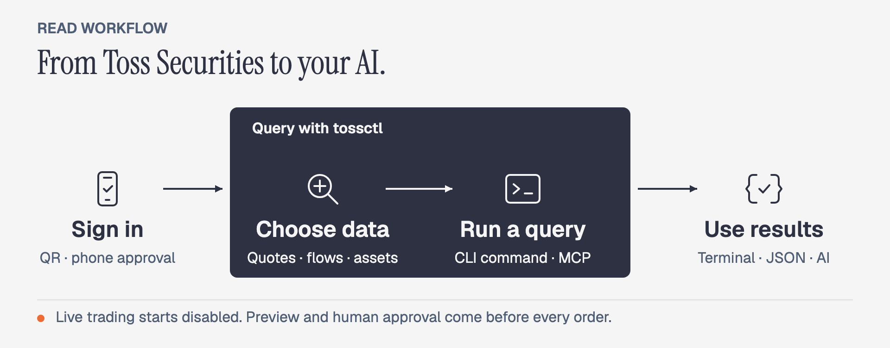

<p align="center">
  <a href="https://tossinvest-cli.vercel.app/"></a>
</p>

<p align="right"><a href="README.md">한국어</a> · <strong>English</strong></p>

<h1 align="center">tossinvest-cli</h1>

<p align="center">
  <strong>Give your AI investment data beyond the official API.</strong>
  <br />From stock discovery to assets, profit, taxes, and watchlists — one <code>tossctl</code>.
</p>

<p align="center">
  <a href="https://github.com/JungHoonGhae/tossinvest-cli/actions/workflows/ci.yml"></a>
  <a href="https://github.com/JungHoonGhae/tossinvest-cli/releases"></a>
  <a href="LICENSE"></a>
</p>

<p align="center">
  <a href="#quick-start"><strong>Quick Start</strong></a> ·
  <a href="#beyond-the-official-api"><strong>Go Beyond the API</strong></a> ·
  <a href="#use-it-with-ai"><strong>Connect AI</strong></a> ·
  <a href="#before-you-place-an-order"><strong>Before Trading</strong></a> ·
  <a href="https://tossinvest-cli.vercel.app/en/docs"><strong>Docs</strong></a>
</p>

> [!WARNING]
> This is not an official Toss Securities product. Features outside the official Open API use Toss Securities' internal web API unofficially, may violate its Terms of Service, and can change without notice. You are responsible for account restrictions, losses, and other consequences of use.

## Beyond the Official API

tossctl brings [**30+ capabilities beyond the official API**](https://tossinvest-cli.vercel.app/en/docs/reference/support-scope) into your AI and automation. Discover stocks, track changes in your assets, and review tax records in one place.

| What else you can do | Official Open API | What tossctl connects |
|---|:---:|---|
| Discover and research stocks | Not supported | Toss AI signals, reasons for price moves, screening, sector analysis |
| Follow news and investment events | Not supported | Holdings and watchlist news, earnings calls, key economic releases |
| Review assets and performance | Not supported | All-account totals, valuation history, dividends, realized profit by period |
| Check taxes and other income | Not supported | Overseas capital gains, deposit interest, expected stock-lending income |
| Manage your investing setup | Not supported | Watchlist folders, price alerts, hidden holdings, accumulation-plan lookup |

**Go from “What's my balance?” to “Summarize my asset changes, dividends received, and holdings news.”** Ask your AI for the information you used to check separately in the app.

<p align="center">
  
</p>

These extra features use WTS, Toss Securities' internal web API. The scope is **Toss Securities**, excluding general Toss banking and card spending. [Compare all supported features →](https://tossinvest-cli.vercel.app/en/docs/reference/support-scope)

## Quick Start

macOS / Linux:

```bash
curl -fsSL https://raw.githubusercontent.com/JungHoonGhae/tossinvest-cli/main/install.sh | sh
tossctl auth login
tossctl account summary --output json
```

Complete phone authentication and approve **Keep this device signed in**. To use a link instead of a QR code, sign in with `tossctl auth login --link`.

<details>
<summary>Windows · Homebrew · Official API setup</summary>

Install in Windows PowerShell, then run the login and query commands above:

```powershell
irm https://raw.githubusercontent.com/JungHoonGhae/tossinvest-cli/main/install.ps1 | iex
```

To connect an official Open API key:

```bash
tossctl openapi login
tossctl openapi status
```

See the [installation guide](https://tossinvest-cli.vercel.app/en/docs/getting-started/installation) for Homebrew and source builds. Run `tossctl doctor --report` to diagnose authentication or connection problems.

</details>

<details>
<summary>Demo — installation through the first query</summary>

<p align="center">
  
</p>

</details>

## Put It to Work

```bash
# Explore the market
tossctl quote flows A005930
tossctl market signals

# Review your dividends
tossctl portfolio dividends

# Pass holdings to your scripts
tossctl portfolio positions --output json
```

The flows command above uses WTS; the official API's investor-trading query is also supported separately. See the [command reference](https://tossinvest-cli.vercel.app/en/docs/reference/commands) for AI signals, dividends, and more.

<details>
<summary>Live streams · API monitoring · Local history</summary>

```bash
# Assets across accounts and a holdings briefing
tossctl account overview
tossctl portfolio briefing

# Stream trades and watch for API changes
tossctl stream --trade A005930
tossctl monitor api           # read-only checks; exit 0 pass, 1 fail
```

Use `tossctl history sync` to preview a collection of holdings and transactions. After saving, `history list`, `history search`, and `history compare` work offline.

Select only the JSON fields you need with `--fields symbol,quantity --compact`. [History and briefing guide →](https://tossinvest-cli.vercel.app/en/docs/guide/history)

</details>

## Use It with AI

<p align="center">
  
</p>

**Connect your installed tossctl to an AI app and ask in plain language.** Claude Code, Codex, and Cursor support MCP connections.

Register MCP with Claude Code:

```bash
claude mcp add tossctl tossctl mcp
```

Ask your connected agent:

> Summarize my asset changes and dividends received, and show news about my holdings.

See the [MCP guide](https://tossinvest-cli.vercel.app/en/docs/guide/mcp) for Codex, Cursor, and other apps.

<details>
<summary>Connect another AI app — MCP settings</summary>

Add this configuration if your AI app supports this MCP format:

```json
{
  "mcpServers": {
    "tossinvest": { "command": "tossctl", "args": ["mcp"] }
  }
}
```

</details>

<details>
<summary>Demo — connect MCP to an AI agent</summary>

<p align="center">
  
</p>

</details>

## Before You Place an Order

> [!IMPORTANT]
> **Live trading is disabled by default.** Agents preview orders. A human must review, approve, and submit each live order.

```bash
tossctl order preview --symbol AAPL --side buy --qty 1 --price 200
# Preview only. A human must review the result and confirmation token before placing an order.
```

- **Check the order:** review the symbol, quantity, and price in the preview, then approve and submit it yourself.
- **Watchlist and alert changes:** check what will change before approving.
- **Unclear submission results:** check order status before trying again.

<details>
<summary>US-options paper trading — experimental</summary>

This feature is still stabilizing and hidden by default. You must also meet Toss Securities' eligibility requirements. Paper balances and orders stay separate from live trading, and paper approval never authorizes a live order. See [support scope](https://tossinvest-cli.vercel.app/en/docs/reference/support-scope) for setup and limits.

</details>

See the [safety guide](https://tossinvest-cli.vercel.app/en/docs/guide/safety) for enabling trading and confirming orders.

## Documentation

| Document | Covers |
|---|---|
| [Quick start](https://tossinvest-cli.vercel.app/en/docs/getting-started/quickstart) | Install through first query |
| [Command reference](https://tossinvest-cli.vercel.app/en/docs/reference/commands) | All CLI commands and examples |
| [Support scope](https://tossinvest-cli.vercel.app/en/docs/reference/support-scope) | Official API and WTS feature matrix |
| [Connect an AI app](https://tossinvest-cli.vercel.app/en/docs/guide/mcp) | Claude Code, Codex, and Cursor setup |
| [Safety guide](https://tossinvest-cli.vercel.app/en/docs/guide/safety) | Settings and checks before live orders |

Report problems or suggestions in [Issues](https://github.com/JungHoonGhae/tossinvest-cli/issues). For security reports, see [`SECURITY.md`](SECURITY.md).

## Sponsors

<p align="center">
  <a href="https://github.com/sponsors/JungHoonGhae"></a>
</p>

<!-- sponsors:start -->

<p align="center">
  <a href="https://github.com/sponsors/JungHoonGhae" title="private sponsor"></a>
</p>

<p align="center"><sub><strong>1</strong> person backs my open-source work (one-time included). Sponsorship funds my projects, tossinvest-cli included.</sub></p>

<!-- sponsors:end -->

## Contributors

Thanks to everyone who has helped build tossinvest-cli. See [`CONTRIBUTING.md`](CONTRIBUTING.md) to join in.

[](https://github.com/JungHoonGhae/tossinvest-cli/graphs/contributors)

## Star History

<!-- star-history:start -->
<picture>
  <source media="(prefers-color-scheme: dark)" srcset="docs/assets/star-history/star-history-v2-dark.svg">
  
</picture>
<!-- star-history:end -->

## License

[MIT](LICENSE)
