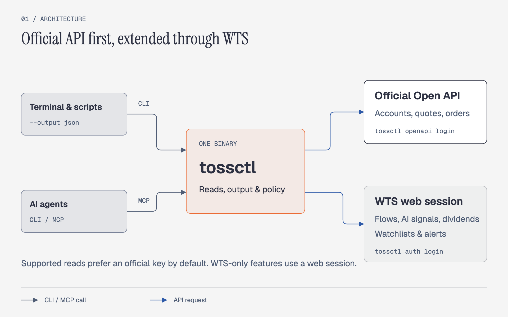
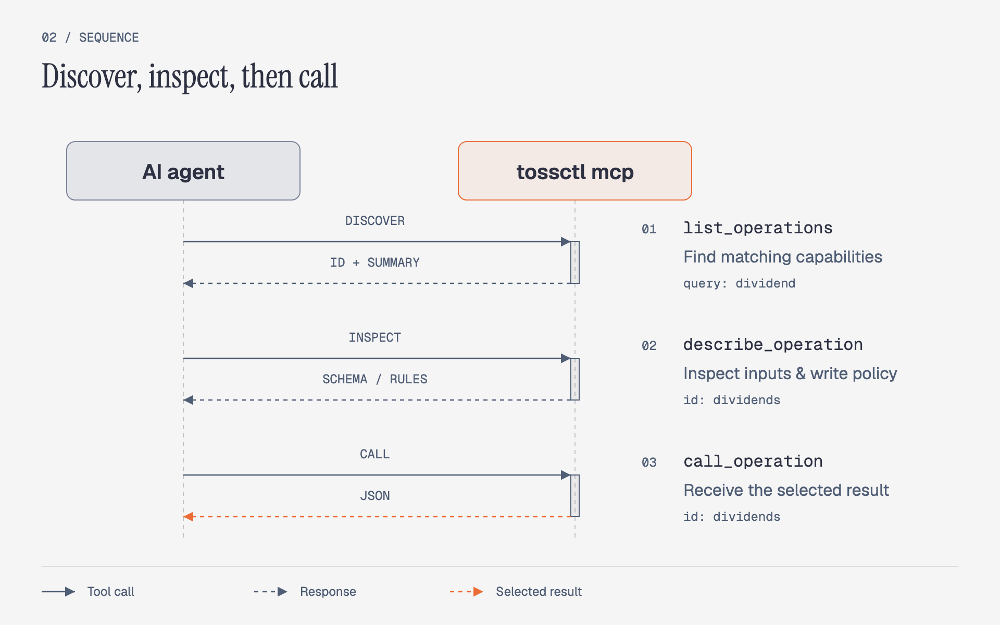
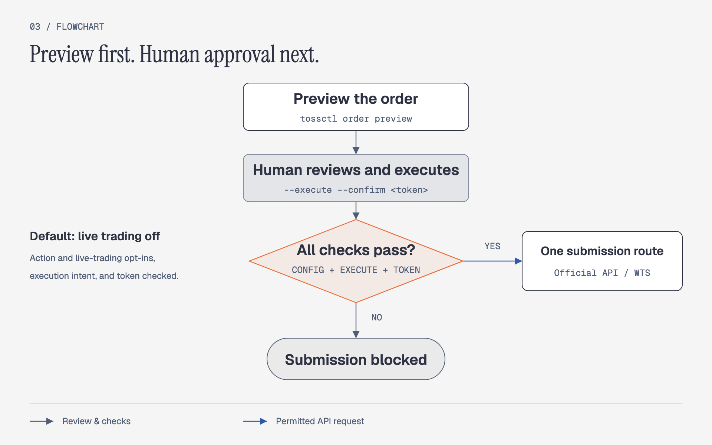
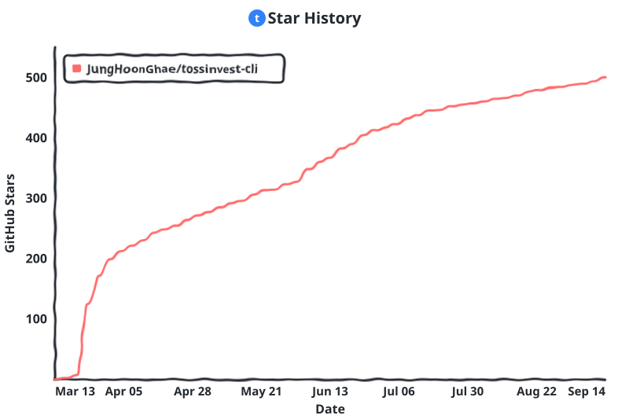

<p align="center">
  <a href="https://tossinvest-cli.vercel.app/"></a>
</p>

<p align="right"><a href="README.md">한국어</a> · <strong>English</strong></p>

<h1 align="center">tossinvest-cli</h1>

<p align="center">
  <strong>Toss Securities beyond the official API, through CLI and MCP.</strong>
  <br />Accounts, quotes, and orders — plus investor flows, AI signals, dividends, and watchlists.<br />One <code>tossctl</code> for your terminal, scripts, and AI agents.
</p>

<p align="center">
  <a href="https://github.com/JungHoonGhae/tossinvest-cli/actions/workflows/ci.yml"></a>
  <a href="https://github.com/JungHoonGhae/tossinvest-cli/releases"></a>
  <a href="LICENSE"></a>
</p>

<p align="center">
  <a href="#quick-start"><strong>Quick Start</strong></a> ·
  <a href="#why-tossctl"><strong>Why tossctl</strong></a> ·
  <a href="#cli-and-mcp"><strong>CLI and MCP</strong></a> ·
  <a href="#safety-model"><strong>Safety</strong></a> ·
  <a href="https://tossinvest-cli.vercel.app/en/docs"><strong>Docs</strong></a>
</p>

> [!WARNING]
> This is not an official Toss Securities product. Features outside the official Open API use Toss Securities' internal web API unofficially, may violate its Terms of Service, and can change without notice. You are responsible for account restrictions, losses, and other consequences of use.

## Why tossctl?

**Bring more of Toss Securities into your automation, beyond accounts and orders.** Investor flows, AI signals, dividend history, and watchlist management are not exposed by the official Open API. tossctl provides them through WTS, Toss Securities' Web Trading System API.

<p align="center">
  
</p>

With an official key, supported reads prefer the official API by default. A web session connects WTS features. The current scope is **Toss Securities**, not general Toss banking or card spending. [Compare all supported features →](https://tossinvest-cli.vercel.app/en/docs/reference/support-scope)

## Quick Start

macOS / Linux:

```bash
curl -fsSL https://raw.githubusercontent.com/JungHoonGhae/tossinvest-cli/main/install.sh | sh
tossctl auth login
tossctl account summary --output json
```

Complete phone authentication and approve **Keep this device signed in**. To use a phone link instead of a QR code, sign in with `tossctl auth login --link`.

<details>
<summary>Windows · Homebrew · Official API setup</summary>

Install in Windows PowerShell, then run the login and query commands above:

```powershell
irm https://raw.githubusercontent.com/JungHoonGhae/tossinvest-cli/main/install.ps1 | iex
```

To connect an official Open API key:

```bash
tossctl openapi login
tossctl openapi status
```

See the [installation guide](https://tossinvest-cli.vercel.app/en/docs/getting-started/installation) for Homebrew and source builds. Run `tossctl doctor --report` to diagnose authentication or connection problems.

</details>

## Put It to Work

```bash
# Explore investor flows and AI signals — WTS-only
tossctl quote flows A005930
tossctl market signals

# Review dividends and assets across accounts — WTS-only
tossctl portfolio dividends
tossctl account overview

# Pass holdings to your scripts
tossctl portfolio positions --output json

# Stream trades and watch for API changes
tossctl stream --trade A005930
tossctl monitor api           # schema-probe 85 endpoints; exit 0 pass, 1 fail
```

You can also manage watchlist folders and price alerts, screen stocks, review transactions, and preview orders. See the [command reference](https://tossinvest-cli.vercel.app/en/docs/reference/commands) or run `tossctl <command> --help` for options.

Use `tossctl history sync` to preview a local collection of holdings and transactions. After saving, `history list`, `history search`, and `history compare` work offline. `portfolio briefing` combines holdings news, earnings calls, and pending orders. Use `--fields symbol,quantity --compact` to select JSON output. [History and briefing guide](https://tossinvest-cli.vercel.app/en/docs/guide/history)

## CLI and MCP

Use the CLI from your terminal or scripts, and MCP with agents such as Claude Code, Codex, and Cursor. Run `tossctl mcp` from the same binary — no separate server package to install.

The default MCP surface is **117 operations**. Agents use `list_operations` to find a capability, `describe_operation` to inspect its input schema and mutation policy, and `call_operation` to invoke it. Only the relevant descriptions enter context, one step at a time.

<p align="center">
  
</p>

```bash
# Claude Code
claude mcp add tossctl tossctl mcp
```

<details>
<summary>Other MCP hosts · Discover operations from the CLI</summary>

Add this configuration if your host supports this format. See the [MCP guide](https://tossinvest-cli.vercel.app/en/docs/guide/mcp) for host-specific setup.

```json
{
  "mcpServers": {
    "tossinvest": { "command": "tossctl", "args": ["mcp"] }
  }
}
```

Shell-capable agents can explore the same catalog:

```bash
tossctl ops list --query dividend
tossctl ops describe dividends
```

</details>

See the [AI agent guide](https://tossinvest-cli.vercel.app/en/docs/guide/agents) and [MCP guide](https://tossinvest-cli.vercel.app/en/docs/guide/mcp) for details.

<details>
<summary>Demo — installation through the first query</summary>

<p align="center">
  
</p>

</details>

<details>
<summary>Demo — connect MCP to an AI agent</summary>

<p align="center">
  
</p>

</details>

## Safety Model

> [!IMPORTANT]
> Live trading is disabled after installation. Even after an action is enabled in config, every real submission requires a preview and confirmation token.

<p align="center">
  
</p>

```bash
tossctl order preview --symbol AAPL --side buy --qty 1 --price 200
# Preview only. A human must review the result and confirmation token before placing an order.
```

| Change | Required to execute | Execution boundary |
|---|---|---|
| **Live order** | Human approval for each order · trading config enabled · `--execute` · preview's `--confirm` token | Regular CLI orders use one official API or WTS backend. MCP and `ops` orders, and all conditional orders, use the official API only |
| **Settings** | Approval for that change · `--execute` · `--confirm` token bound to current state and intent | Watchlists, price alerts, and similar changes. Irreversible actions require an additional acknowledgement |
| **Paper trade** | Experimental opt-in · approval to change the paper ledger · `--execute` | Separate paper ledger. Approval cannot be reused for live trading |

If an order's transport result is unclear, check its status first. Failed orders are never automatically resubmitted through another API backend.

See the [safety guide](https://tossinvest-cli.vercel.app/en/docs/guide/safety) and [`docs/configuration.md`](docs/configuration.md) for the full policy.

<details>
<summary>Experimental — US-options paper trading</summary>

This feature is still stabilizing and hidden by default. Add the following to `config.json` to expose its commands and MCP operations. Enabling it does not bypass server-side eligibility requirements.

```json
{
  "experimental": {
    "paper_trading": true
  }
}
```

Experimental APIs may change and never promote themselves to live-trading authorization. Their current status and limits are tracked in the [support scope](https://tossinvest-cli.vercel.app/en/docs/reference/support-scope).

</details>

## Documentation

| Document | Covers |
|---|---|
| [Quick start](https://tossinvest-cli.vercel.app/en/docs/getting-started/quickstart) | Install through first query |
| [Command reference](https://tossinvest-cli.vercel.app/en/docs/reference/commands) | All CLI commands and examples |
| [Support scope](https://tossinvest-cli.vercel.app/en/docs/reference/support-scope) | Official API and WTS feature matrix |
| [Configuration](docs/configuration.md) | Config fields and local state |
| [Operations](docs/operations.md) | Session renewal, API monitoring, scheduled checks and alerts |
| [Architecture](docs/architecture.md) | Routing, modules, and safety boundaries |
| [Diagram sources](diagrams/README.md) | README diagram HTML and image rendering instructions |
| [Changelog](CHANGELOG.md) | Release changes and contributor credits |

## Development and Contributing

Build locally with `make build` and run tests with `make test`.

Use [Issues](https://github.com/JungHoonGhae/tossinvest-cli/issues) for bugs and proposals, and Pull Requests for changes. See [`CONTRIBUTING.md`](CONTRIBUTING.md) for project conventions and [`SECURITY.md`](SECURITY.md) for security reports.

## Sponsors

<p align="center">
  <a href="https://github.com/sponsors/JungHoonGhae"></a>
</p>

<!-- sponsors:start -->

<p align="center">
  <a href="https://github.com/sponsors/JungHoonGhae" title="private sponsor"></a>
</p>

<p align="center"><sub><strong>1</strong> person backs my open-source work (one-time included). Sponsorship funds my projects, tossinvest-cli included.</sub></p>

<!-- sponsors:end -->

## Contributors

Thanks to everyone who has helped build tossinvest-cli. See [`CONTRIBUTING.md`](CONTRIBUTING.md) to join in.

[](https://github.com/JungHoonGhae/tossinvest-cli/graphs/contributors)

## Star History

<!-- star-history:start -->
<picture>
  <source media="(prefers-color-scheme: dark)" srcset="docs/assets/star-history/star-history-v2-dark.svg">
  
</picture>
<!-- star-history:end -->

## License

[MIT](LICENSE)
