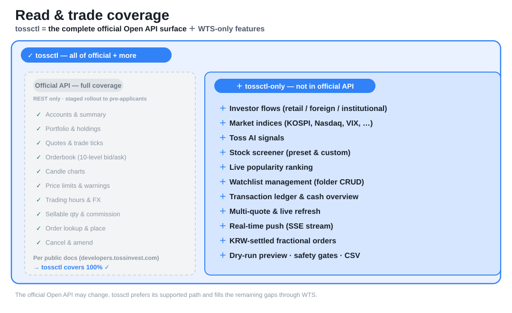
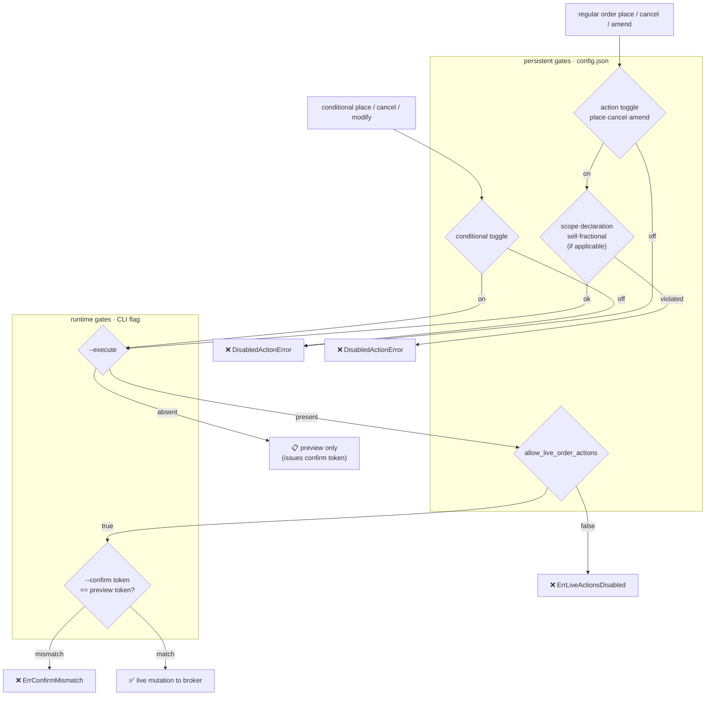

<p align="center">
  <a href="https://tossinvest-cli.vercel.app/"></a>
</p>

<p align="right"><a href="README.md">한국어</a> · <strong>English</strong></p>

<div align="center">
  <h1>tossinvest-cli</h1>
  <p><strong>The most flexible way to connect Toss Securities. Via CLI, via MCP server, from any AI agent — 100% of the official API, plus the features only the web app had.</strong></p>
  <p>Claude Code · Codex · Gemini · Cursor · GitHub Copilot — any AI agent drives Toss Securities accounts, quotes, and trades through one <code>tossctl</code>. <strong>Attach it as an MCP server (<code>tossctl mcp</code>) or run it by hand</strong>, <strong>with no key at all — or auto-routed through the official path when you connect one.</strong></p>
  <p><sub>Investor flows · market indices · AI signals · screener · watchlist management · transaction ledger · real-time push · fractional orders · dry-run preview — 51 tossctl-only capabilities beyond the official Open API, with <strong>100% of the official Open API's coverage included too.</strong> <a href="#support-scope">Full comparison ↓</a></sub></p>
  <p><sub><em>An unofficial Toss Securities CLI for AI agents. Auto-routes through the official OAuth path when you connect an official key.</em></sub></p>
</div>

<p align="center">
  
</p>

<p align="center">
  <sub>One-line install → QR login → query right away. <a href="#quick-start"><strong>Get started ↓</strong></a></sub>
</p>

<p align="center">
  <a href="LICENSE"></a>&nbsp;
  <a href="https://go.dev/"></a>&nbsp;
  
</p>

<p align="center">
  &nbsp;
  <a href="https://tossinvest-cli.vercel.app/docs/guide/hybrid-openapi"></a>
</p>

<p align="center">
  <a href="#quick-start"><strong>Quick Start</strong></a> ·
  <a href="#support-scope"><strong>Support Scope</strong></a> ·
  <a href="#command-reference"><strong>Command Reference</strong></a> ·
  <a href="#faq"><strong>FAQ</strong></a> ·
  <a href="#sponsors"><strong>Sponsors</strong></a>
</p>

<p align="center">
  <a href="https://github.com/JungHoonGhae/tossinvest-cli/stargazers"></a>
  <a href="https://github.com/JungHoonGhae/tossinvest-cli"></a>
  <a href="https://github.com/JungHoonGhae/tossinvest-cli/actions/workflows/ci.yml"></a>
</p>

> [!WARNING]
> This is **not** an official Toss Securities product. When you connect an official Open API key, those features run through Toss's officially supported path; everything else reuses Toss's internal web API unofficially, which may violate Toss Securities' Terms of Service. The API can change without notice, and the author takes no responsibility for account restrictions, losses, or other consequences. Use at your own risk and discretion.

> [!IMPORTANT]
> Trading is fully disabled out of the box. Each action must be explicitly enabled in `config.json` before it can run.

## Sponsors

<p align="center">
  <a href="https://github.com/sponsors/JungHoonGhae"></a>
</p>

<!-- sponsors:start -->

<p align="center">
  <a href="https://github.com/sponsors/JungHoonGhae" title="비공개 후원자 / private sponsor"></a>
</p>

<p align="center"><sub><strong>1</strong> person backs my open-source work (one-time included). Sponsorship funds my projects, tossinvest-cli included.</sub></p>

<!-- sponsors:end -->

## Quick Start

**Pick by how you'll use it.**

- **Through an AI assistant (Claude, Codex, Cursor…)** → **MCP is simplest.** Register once
  (`claude mcp add tossctl tossctl mcp`) and the agent handles it in natural language. → [MCP quick start](#mcp-quick-start--3-steps)
- **Terminal, scripts, automation, or the full toolset (incl. WTS writes & real-time)** → **CLI.**
  Start right below. ↓

Both take one login and share the same `tossctl`. Details: [CLI vs MCP — when to use which](#cli-vs-mcp--when-to-use-which-complementary).

### For Agents

```text
Install tossinvest-cli:
  curl -fsSL https://raw.githubusercontent.com/JungHoonGhae/tossinvest-cli/main/install.sh | sh
(macOS/Linux) or GitHub Releases (Windows).

Run `tossctl doctor` to verify setup, then complete browser login with
`tossctl auth login`. Use read-only commands first (account, portfolio, quote).
Trading actions stay disabled until config.json explicitly allows them.
Always run `tossctl order preview` before any trading mutation.
```

### For Humans

macOS / Linux:

```bash
curl -fsSL https://raw.githubusercontent.com/JungHoonGhae/tossinvest-cli/main/install.sh | sh
```

Windows (PowerShell):

```powershell
irm https://raw.githubusercontent.com/JungHoonGhae/tossinvest-cli/main/install.ps1 | iex
```

Verify:

```bash
tossctl version
tossctl doctor
tossctl auth login
tossctl account summary --output json
```

> `auth login` requires Google Chrome and Python; the install script sets them up automatically.
> Other install methods (Windows, Homebrew, from source) are in [Install](#install).
>
> After scanning the QR, make sure to tap the **"keep this device signed in"** confirmation on your phone.
> Skipping that second confirmation expires the session after ~1h idle. Verify with `tossctl auth status` showing `Persistence: persistent cookie (expires ...)`.

> **Link login:** run `tossctl auth login --link`, then open the printed URL on your phone to launch Toss without scanning a QR code. Select the answer letter and confirm **“Keep me signed in on this device.”**
> The existing `--headless` mode behaves the same way in SSH/CI environments; add `--qr-output /tmp/toss-qr.png` only when you also need a QR image. The file is written with `0600` permissions.

### Session extension

Toss runs an ~7-day server-side activity expiry separate from the SESSION cookie. From 24h before expiry, every command prints a stderr warning:

```
⚠ session expires in ~18h; run `tossctl auth extend` to renew
```

`tossctl auth extend` sends a push to the Toss app on your phone and waits for approval:

```
$ tossctl auth extend
Waiting for approval in the Toss app on your phone...
✓ Extension complete. New expiry: 2026-05-13 07:03 KST (took 4s)
```

The default timeout is 120s; shorten it with `--timeout 60s`.

#### Renewing before it lapses

Phone approval is Toss's second factor and can't be removed — but *when* to ask for it can be
automated. `--if-expiring` checks the server-side remaining time first and exits 0 doing nothing
if there's more room than the given window. Put it on a scheduler and the phone only buzzes on
the days it actually matters.

```bash
tossctl auth extend --if-expiring 48h   # extend if under 48h left, otherwise no-op
```

macOS launchd example — check daily at 09:00:

```xml
<!-- ~/Library/LaunchAgents/com.tossctl.extend.plist -->
<key>ProgramArguments</key>
<array>
  <string>/opt/homebrew/bin/tossctl</string>
  <string>auth</string><string>extend</string>
  <string>--if-expiring</string><string>48h</string>
</array>
<key>StartCalendarInterval</key>
<dict><key>Hour</key><integer>9</integer><key>Minute</key><integer>0</integer></dict>
```

Register with `launchctl load ~/Library/LaunchAgents/com.tossctl.extend.plist`.
For cron: `0 9 * * * /opt/homebrew/bin/tossctl auth extend --if-expiring 48h`.

> The value is a Go duration — `7d` is rejected, use `168h`.

## Support Scope

> **tossctl covers 100% of the official Toss Open API's read & trade coverage — and goes beyond.**
> It maps to every endpoint in the official [Open API docs](https://developers.tossinvest.com/docs) (accounts, holdings, quotes, orderbook, ticks, candles, price limits, sellable quantity, commissions, orders, …), and adds investor flows, market indices, AI signals, screener, watchlist management, transaction ledger, real-time push, fractional orders, dry-run preview, and more — **51 capabilities that aren't in the official API are tossctl-only.**

<p align="center">
  
</p>

The Toss Securities official Open API is currently **rolling out in stages to pre-applicants** and is a narrow, REST-only API (public docs: <https://developers.tossinvest.com/docs>). The `Official API (planned)` column below reflects that documented coverage, and the `tossctl` column is what we provide. **Every ✅ in the official column is also ✅ for tossctl — we cover 100% of the official API.**

- ✅ supported · ❌ not supported · 🔸 partial · 🆕 added within the last month
- **`Official API (planned)` column = staged rollout to pre-applicants. ✅/🔸/❌ is expected coverage at launch** (subject to change across rollout phases).
- **Rows where `Official API (planned)` is ❌ = tossctl-only.**
- **Verified version**: the `Official API` column in the tables/diagram below reflects verification against the **official Open API version shown in the badge above** (that version & last-checked date are recorded in [`.openapi-snapshot.json`](docs/migration/.openapi-snapshot.json)). The full spec is mirrored daily to [`docs/migration/openapi.latest.json`](docs/migration/openapi.latest.json); any change is auto-detected, alerted, and updated.

### Read-only · US & KR

| Feature | Command | Official API (planned) | tossctl |
|------|--------|:--:|:--:|
| Accounts / summary | `account list`, `account summary` | ✅ | ✅ |
| 🆕 Buying power (official) | `account buying-power [--currency KRW\|USD]` (cash-based; distinct from account summary) | ✅ | ✅ |
| Portfolio | `portfolio positions`, `portfolio allocation` (USD for US) | ✅ | ✅ |
| Trade ticks | `quote trades <symbol> --count N` | ✅ | ✅ |
| Orderbook (10-level bid/ask) | `quote orderbook <symbol>` | ✅ | ✅ |
| Price limits | `quote limits <symbol>` (KR) | ✅ | ✅ |
| Trade warnings | `quote warnings <symbol>` (liquidation · alert · VI …) | ✅ | ✅ |
| Trading hours | `market hours` (today + next session when closed) | ✅ | ✅ |
| 🆕 Trading calendar | `market business-days <KR\|US>` (previous/today/next session times, KR auctions) | ✅ | ✅ |
| FX | `market fx` (USD rate · dollar index) | ✅ | ✅ |
| 🆕 Circuit breaker / sidecar | `market halt` (KOSPI · KOSDAQ firing state) | ❌ | ✅ |
| 🆕 Index anomalies | `market anomalies` (AI signal · keyword · z-score) | ❌ | ✅ |
| 🆕 Batch AI reasons | `quote reasons <symbols...>` (up to 100 in one call) | ❌ | ✅ |
| 🆕 Batch intraday candles | `quote charts <symbols...>` (many symbols, one call) | ❌ | ✅ |
| Sellable quantity | `quote sellable <symbol>` (sellable shares for a held symbol) | ✅ | ✅ |
| Commission / tax rate | `quote commission <symbol>` | ✅ | ✅ |
| Orders (pending / completed / single) | `orders list`, `orders completed`, `order show <id>` | ✅ | ✅ |
| Quote | `quote get <symbol>` (OHLC · 52w · market cap · trading value · strength) | 🔸 *(no strength/52w etc.)* | ✅ |
| Candle chart | `quote chart --interval 1m\|3m\|5m\|10m\|15m\|30m\|60m` | 🔸 *(1m / daily only)* | ✅ |
| **Multi-quote / live refresh** | `quote batch <sym>[,sym,...]` (`--chart` · `--live`) | ❌ | ✅ |
| **🆕 Batch stock metadata** | `quote metadata <sym>[,sym,...]` (ISIN · market · type · listing status · shares, up to 200) | ✅ | ✅ |
| **🆕 Crypto prices + premium** | `quote crypto BTC,ETH,SOL,XRP` (OHLC · 52w · Korea premium) | ❌ | ✅ |
| **🆕 Market universe** | `market stocks KOSPI\|NASDAQ\|…` (filters: `--status`·`--security-type`·`--common-share`) | ✅ | ✅ |
| **🆕 Stock supply (5 series)** | `quote supply <symbol> --type investor\|short\|credit\|lending\|program` | ✅ | ✅ |
| **🆕 Screener filter ranges** | `market filters PER PBR --nation kr\|us` (min/max · base date) | ❌ | ✅ |
| **🆕 US option expiries & chain** | `quote options <symbol> [--expiry]` (per-strike call/put open interest) · contract codes work in `quote get`/`orderbook`/`chart` | ❌ | ✅ |
| **🆕 Why a stock moved (AI)** | `quote reasoning <symbol>` (explanation + related stocks) | ❌ | ✅ |
| **🆕 Per-stock signals** | `quote signals <symbol>` (bullish/bearish cards) | ❌ | ✅ |
| **🆕 Unified search** | `search <name\|ticker>` (resolve product codes) | ❌ | ✅ |
| **🆕 Receivable / liquidation notice** | `account receivable --currency KRW\|USD` | ❌ | ✅ |
| **Investor flows** | `quote flows <symbol>` (retail · foreign · inst., KR) | ❌ | ✅ |
| **Market indices** | `market index` (KOSPI · KOSDAQ · Nasdaq · S&P500 · VIX), `market index <code\|name>` detail (OHLC · 52w) | ❌ | ✅ |
| **Live popularity ranking** | `market ranking --size N` | ❌ | ✅ |
| **Official ranking (amount/change%)** | `market rankings --type ... --market KR --duration 1d` | ✅ | ✅ |
| **Market indicator price** | `market indicator KOSPI,KOSDAQ` | ✅ | ✅ |
| **Market indicator candles** | `market indicator-candles KOSPI --interval 1d` | ✅ | ✅ |
| **Market investor trading** | `market investor-trading KOSPI --interval 1d` | ✅ | ✅ |
| **Conditional order reads** | `order conditional list`, `order conditional get <id>` | ✅ | ✅ |
| **Conditional order trading** | `order conditional place\|cancel\|modify` (safety gate: config opt-in + --execute + --confirm) | ✅ | ✅ |
| **Net-buy ranking by investor** | `market investors` (foreign · institution · retail top net-buy) | ❌ | ✅ |
| **Earnings calendar** | `market earnings` (`--major` for curated majors) | ❌ | ✅ |
| **Dividend report** | `portfolio dividends` (annual total · region · monthly, `--by-payment-date` tax) | ❌ | ✅ |
| **Cumulative realized profit** | `profit` (trading gains · dividends · lending · maturity · deposit interest, KRW/USD — a cumulative view distinct from account summary) | ❌ | ✅ |
| **Account detail** | `account detail [--full]` (number · open date + **withdrawable cash and caps** + credit-trading status + **US dividend payout mode** — number and name masked by default) | ❌ | ✅ |
| **🆕 All-account assets** | `account overview [--full]` (regular and minor accounts · pending-order counts — account numbers masked by default) | ❌ | ✅ |
| **Automated trading** | `order autotrade` (stop-loss / target-profit / OCO / OTO rules with trigger and order prices — read-only) | ❌ | ✅ |
| **Market news** | `market news [--type all\|watchlist\|holdings\|soaring\|latest\|recommended] [--limit N] [--full]` (each article's **related stocks and their moves** — what a headline list lacks) | ❌ | ✅ |
| **Market issue board** | `market issues [--full]` (topics ranked by attention, with rank movement ▲▼ and backing articles) | ❌ | ✅ |
| **Market calendar** | `market calendar [--month YYYY-MM]` (releases with **forecast / actual / prior**, KR+US **earnings** with symbol and call time, holidays — by month) | ❌ | ✅ |
| **Realized profit by period** | `profit summary --type sales\|dividend\|lending\|account-interest [--from --to]` (one category's earned amount, return rate, purchase basis in KRW/USD) | ❌ | ✅ |
| **Per-stock daily realized profit** | `profit daily [--from --to] [--currency KRW\|USD]` (symbol · quantity · P/L · rate · sell/buy amounts, every page merged — CSV for tax prep) | ❌ | ✅ |
| **Overseas transfer income (tax)** | `tax overseas --year YYYY` (capital-gains filing: rate · deduction · per-stock P/L) | ❌ | ✅ |
| **Toss Prime status & benefits** | `account prime` (fee/interest across three tiers: standard, Prime, your rate) | ❌ | ✅ |
| **🆕 Deposit interest (예탁금 이용료)** | `account interest --year YYYY` (per payment: pre-tax · tax · net · accrual period · estimated flag) | ❌ | ✅ |
| **🆕 Commission schedule** | `account commission` (KR/US equity rates, US options per-contract fee, reduced-rate status) | ❌ | ✅ |
| **🆕 Order funding gap** | `order funding` (whether buying is possible now · deposit needed · exchange needed) | ❌ | ✅ |
| **🆕 US options trading hours** | `market option-hours` (previous · today · next business-day sessions) | ❌ | ✅ |
| **🆕 Popular community lounges** | `community boards` (lounges by follower count · comment counts · joined) | ❌ | ✅ |
| **Expected lending income** | `lending expected` (projected share-lending income: monthly/yearly USD + per-stock) | ❌ | ✅ |
| **Community rankings** | `community rankings --type influencer\|profit\|followers` | ❌ | ✅ |
| **Sector movements** | `market sectors [id]` (industry tree, 1d·1m·1y returns) | ❌ | ✅ |
| **Theme fluctuation ranking** | `market themes` (today's top-moving themes, rising-stock counts) | ❌ | ✅ |
| **Personalized news briefing** | `market briefing` (holding/watchlist asset · return · AI reasoning · news and related stocks) | ❌ | ✅ |
| **🆕 Key earnings & economic releases** | `market key-events` (estimates · actuals · surprises · previous values) | ❌ | ✅ |
| **🆕 Stock-accumulation open-banking status** | `banking status [--full]` (holder and account number masked by default) | ❌ | ✅ |
| **🆕 Notification preferences** | `notifications list` (read-only; internal user ID omitted) | ❌ | ✅ |
| **Toss AI signals** | `market signals` (per-symbol AI signal · keywords · move) | ❌ | ✅ |
| **Stock screener** | `market screener [id]` (preset) · `--filter '<json>'` (custom) `--nation kr\|us` | ❌ | ✅ |
| **Watchlist read & management** | `watchlist list [<group-id>] [--all]`·`groups`, `watchlist group create\|rename\|delete`, `watchlist add\|remove --group <id>` | ❌ | ✅ |
| **Transaction ledger** | `transactions list --market us\|kr` (trades · transfers · dividends) | ❌ | ✅ |
| **Cash overview** | `transactions overview --market us\|kr` (orderable · withdrawable · incoming) | ❌ | ✅ |
| **CSV export** | `export positions\|orders --market`, `transactions list --output csv` | ❌ | ✅ |
| **Real-time push** | `push listen` (SSE stream — order/price change events) | ❌ *(official API uses websockets)* | ✅ |
| **🆕 Real-time stream (websocket)** | `stream --trade\|--orderbook\|--order` (executions, order book, own orders) | ✅ | ❌ *(web only has SSE alerts)* |

`quote charts` and `quote reasons` preserve request order even when the server omits symbols
with no data. JSON reports omitted inputs in `missing`; CSV emits a symbol-only empty row for
each omission. A successful chart response with zero candles also remains as an empty-series
row. Automation should inspect `missing` or empty CSV fields instead of assuming response rows
always equal requested symbols.

#### 📱 Mobile-app-only features (no web UI either)

Most rows above have a screen in the Toss web app (WTS). The features below go one
step further — they exist **only in the Toss mobile app, with no web UI at all**.
tossctl opens even these up, via backend APIs callable with a web session.

| Feature | Command | Mobile app | Web (WTS) | tossctl |
|---------|---------|:--:|:--:|:--:|
| **🆕 RIA tax-saving report** | `tax ria` (overseas capital-gains saving account: tax before/after deduction · saving · weighted quarterly P/L · sell limit) | ✅ | ❌ (no UI) | ✅ (read) |
| **Stock accumulation plans** | `accumulate list`, `accumulate status <symbol>` (recurring auto-buy: Active/Paused · amount/frequency · rounds) | ✅ (settings UI) | ❌ (no UI) | ✅ (read) |
| **US dividend payout mode** | the «미국 배당» block in `account detail` (`CASH` paid out / `STOCK` reinvested + last change date) | ✅ (settings UI) | ❌ (no UI) | ✅ (read) |

> This list moves rows into the general table above once Toss ships a web UI for them.
> (Criterion: whether a real screen renders at the web route — tracked by the weekly monitor.)

### Trading

The official API also offers order create/amend/cancel, but tossctl's trading UX/safety — **fractional orders, currency mode, dry-run preview, config-based safety gates** — is our own.

| Feature | Command | Required config | Official API (planned) | tossctl |
|------|--------|-------------|:--:|:--:|
| Limit buy (US/KR) | `order place --side buy --price <value>` | `place` | ✅ | ✅ |
| Limit sell (US/KR) | `order place --side sell --price <value>` | `place` + `sell` | ✅ | ✅ |
| Korean stock trading | `order place --market kr` (6-digit codes auto-detected) | `place` | ✅ | ✅ |
| 🆕 Opening / closing auction orders | `order place --time-in-force OPG\|CLS` (OPG = KR opening single-price, CLS = US LOC) | `place` | ✅ | ❌ |
| Cancel | `order cancel --order-id <id>` | `cancel` | ✅ | ✅ |
| Amend | `order amend --order-id <id>` | `amend` | ✅ | ✅ |
| **Fractional buy (US, amount-based)** | `order place --fractional --amount <value>` (KRW default; `--currency-mode USD`) | `place` + `fractional` | ❌ | ✅ |
| **Dry-run / preview** | `order preview` (validate without sending) | — | ❌ | ✅ |

All trades also require `allow_live_order_actions=true`. Fractional orders auto-convert to market orders and are amount-based (`--currency-mode KRW` default or `USD`).

> ⏰ **Fractional order cutoff** — amount orders and fractional-quantity orders are accepted only until **1 hour before the US regular session closes**, not until the close itself. After that the server rejects them with `422`. This window was narrowed in Toss's official Open API 1.2.9.

US limit prices choose interpretation via `--currency-mode`: `KRW` (default, converted to USD at the server rate) or `USD` (sent as-is). e.g. `order place --symbol MRVL --side buy --qty 1 --price 158.01 --currency-mode USD`.

> 💵 **Limit prices must land on a tick** — US ticks are **0.0001 below $1 and 0.01 at or above $1** (KR uses price-band ticks, e.g. ₩100 between 50,000 and 200,000). Off-tick prices get `400 invalid-request` with the nearest valid prices in `data.nearestPrices`. tossctl sends the price as-is, so this validation happens server-side.

### Why tossctl — the official API is a fraction of Toss

The official Open API offers only **basic REST read/order** (~20 endpoints). Toss's
own web app (WTS) actually uses **~440 meaningful read/trade endpoints** — that's
after excluding noise like onboarding, KYC, terms, promotions, and telemetry.

> **The official Open API covers only ~4% of that.** tossctl works across the
> rest, already ships features the official API lacks (investor flows, market indices,
> AI signals, screener, by-investor net-buy, earnings calendar, dividend reports,
> community rankings, sector movements, news briefing, real-time push, fractional orders, dry-run preview, …),
> and **keeps implementing the remaining endpoints.**

Why tossctl wins long-term:

- **Flexibility — the most open way to connect Toss Securities.** Via a terminal CLI, via an [MCP server](#mcp-server-tossctl-mcp) to any AI agent (Claude Code · Codex · Gemini · Cursor · Copilot), or from a script — all handled by **one `tossctl`**. **Start with no key at all**, and get **auto-routing** through the official path once you connect one. Not locked to any app, SDK, language, or agent.
- **Breadth** — the official API opens a narrow API slowly; tossctl tracks the whole web API (catalog below) and is always wider.
- **Speed** — on any platform new features integrate fastest inside the first-party app, so they always land in the web app (WTS) first, and a public API opens only a stable subset later (not anyone's fault, just the shape of the platform). The weekly monitor flags each new endpoint, so tossctl implements it **without waiting for an official release**. [Why the official API lags ↗](https://tossinvest-cli.vercel.app/docs/guide/hybrid-openapi)
- **Superset** — whatever the official API covers, tossctl [already covers 100%](#support-scope).

#### WTS web API catalog (continuously tracked)

Every `/api/*` endpoint is extracted from the web bundles and classified as
**implemented / next candidate / intentionally excluded**; additions, changes, and
removals are caught by a weekly monitor. (Badge counts use the **meaningful API,
excluding noise**, and auto-update from the catalog.)

<p align="center">
  <a href="docs/reverse-engineering/wts-endpoints.json"></a>
  <a href="docs/reverse-engineering/wts-endpoints.json"></a>
  <a href="docs/reverse-engineering/wts-endpoints.json"></a>
  
</p>

- Full catalog: [`docs/reverse-engineering/wts-endpoints.json`](docs/reverse-engineering/wts-endpoints.json).

### Safety Model

Trading is disabled by default. For a single live order to reach the broker, it must pass both the **persistent (config) gates** and the **runtime (flag) gates**.



- **Persistent gates (config.json):** `place`/`cancel`/`amend` for regular orders, `conditional` for conditional orders, plus `sell`/`fractional` scope declarations and the `allow_live_order_actions` master kill-switch. (Market US/KR is not a gate — a KR order is no riskier than a US one, so they're treated symmetrically.)
- **Runtime gates (every run):** `--execute` (perform the real mutation, not preview) + `--confirm <token>` (the per-order token from preview).
- The real safety is the per-order `--confirm <token>` — you can only get it by running preview, so an unintended order is blocked by a token mismatch.

> **v0.5.x simplification:** removed the redundant TTL grant layer (`internal/permissions`; `allow_live_order_actions` already provides the same protection) and retired the misnamed `--dangerously-skip-permissions` (no permissions left to point at, and its meaning was inverted). The old flag is accepted as a deprecated no-op alias for one release to keep scripts/agents working.

## MCP server (`tossctl mcp`) <!--since:2026-07-08-->

`tossctl` exposes both the official Toss Open API **and WTS-only features** as an **MCP
(Model Context Protocol) server**. Register it in an MCP host (Claude Code, Claude Desktop,
Codex, …) and an agent can query accounts, prices, order book, candles (official) plus
**rankings, investor flows, AI signals, screener, sectors, earnings, briefing, dividends and
more (WTS-only)** in natural language — and **place, cancel, or modify orders**. It speaks
JSON-RPC 2.0 over stdin/stdout — no separate server or port.

### MCP quick start — 3 steps

MCP is a mode of the `tossctl` binary (`tossctl mcp`), so **install the CLI first**, connect an
official key, then register it with your host:

```bash
# 1) Install tossctl (macOS/Linux — see the "Install" section for Windows/Homebrew/source)
curl -fsSL https://raw.githubusercontent.com/JungHoonGhae/tossinvest-cli/main/install.sh | sh

# 2) Authenticate — at least one is enough (only ops for the missing auth are disabled)
tossctl openapi login    # Official Open API: official reads + orders (get a key: https://corp.tossinvest.com/ko/open-api)
tossctl auth login       # WTS web session: WTS-only reads (rankings, flows, AI signals, …)

# 3) Register with your MCP host + verify (Claude Code example)
claude mcp add tossctl tossctl mcp
claude mcp list   # → "tossctl: tossctl mcp - ✔ Connected"
```

<p align="center">
  
</p>

For JSON-config hosts (Claude Desktop, Codex, …) use the [config example](#mcp-host-json-config)
below. To use the CLI **by hand** in a terminal, skip MCP and just run `tossctl auth login` (web
session) for the full feature set — see [Quick Start](#quick-start). Both paths share the one
`tossctl`.

### Why a catalog — a fixed 3-tool always-on cost

MCP's inherent cost is that **tool schemas stay resident in the model's context**. Register one
tool per API and every tool's name, description, and parameter schema occupies context for the
whole conversation. tossctl's surface is **87 operations** across official and WTS reads,
regular and conditional orders, and system operations — exposing them individually would keep **87 schemas always loaded**,
burning tokens and adding tool-choice noise (mis-picks between similar tools).

Following KIS_MCP_Server's catalog mode, tossctl fronts everything with **just three fixed
tools** and keeps the 87 operations behind an **on-demand schema fetch**:

- `list_operations` — list available operations (id, summary, write flag), filter with `query`
- `describe_operation` — fetch one operation's parameter schema **only at that moment**
- `call_operation` — call by id with parameters

Result: the always-on context is **exactly three tool schemas**. Whether there are 20 operations
or 100, the resident cost stays at three. The agent finds an operation via `list_operations` →
reads its schema via `describe_operation` → calls it via `call_operation`, so unused operations
never sit in context. (The very Claude Code session reading this README sees `tossctl` as just
those three tools.)

Arguments to `call_operation` must match the names and primitive types declared by
`describe_operation`. Unknown parameters, fractional values for integer fields, and integers
that would lose precision when converted to `float64` fail before any backend call. Refresh the
operation schema immediately before calling instead of mixing in parameters from an older copy.

### What MCP exposes — reads: official + WTS; orders: official only

MCP exposes **reads from both the official Open API and WTS-only features**, and keeps
**order writes on the official API path only**. The sole WTS settings write is official Open API
allowed-IP replacement, protected by preview, confirmation, server re-verification, and rollback.
Each operation is tagged with a `backend`
in `list_operations`: `"wts"` (needs a web session), `"auto"` (**either credential works** —
official first, web-session fallback), or official-only otherwise.

- **Reads.** Official (accounts, quotes, orderbook, candles…) plus **WTS-only** (rankings,
  flows, AI signals, screener, sectors, earnings, briefing, dividends — the
  [Toss-unique features](#why-tossctl--the-official-api-is-a-fraction-of-toss)). WTS reads need
  a web session; without one, those operations return a `tossctl auth login` hint. A failed read
  is at worst a stale read, so exposing it to an agent is low-risk.
- **Writes.** Regular and conditional place / cancel / modify always use the **official API path** (never WTS): if an
  agent can submit orders, the path should be one **Toss officially sanctions** — safer and more honest.
- **WTS settings write (sole exception).** `openapi_ip_replace_current` changes only the official
  Open API allowlist. It previews by default, requires `execute:true` plus a valid `confirm` token,
  re-verifies server state, and restores the previous list on failure. WTS order and watchlist
  writes remain unavailable through MCP.
- **Split auth.** Official reads/orders use the official key (`openapi login`); WTS reads use the
  web session (`auth login`). **Either alone starts the server**, and each operation checks the
  auth it needs.

So the **WTS-only features that used to be CLI-only are now reachable from an agent via MCP too.**

> **Updates are automatic.** The host stores the *command* `tossctl mcp` and respawns it each
> session, so `brew upgrade tossctl-cli` (or `tossctl update`) makes new operations appear with
> **no re-registration** (the catalog is built from the binary at startup). When a newer version
> exists, the server also surfaces an "update available" note in its initialize `instructions`
> so MCP-only users (who never see the CLI's stderr) learn about it through their agent.

Regular (`place_order`, `cancel_order`, `modify_order`) and conditional (`place_conditional_order`,
`cancel_conditional_order`, `modify_conditional_order`) mutations are **gated exactly like the
`tossctl order` CLI**: enable them in config
(`trading.*` + `allow_live_order_actions`); a plain call returns a dry-run preview with a
`confirm_token`, and submitting requires `execute: true` plus `confirm: <token>`. Writes use the
official API only (no WTS).

### MCP host JSON config

Claude Code is done with the one-line `claude mcp add` from the [MCP quick start](#mcp-quick-start--3-steps)
above. JSON-config hosts (Claude Desktop, Codex, …) take this in their config file (`tossctl` must
be on PATH):

```json
{
  "mcpServers": {
    "tossinvest": { "command": "tossctl", "args": ["mcp"] }
  }
}
```

### CLI vs MCP — when to use which (complementary)

Two entry points to the same `tossctl` binary, and **both work well with AI agents** — not competitors, just different connection mechanisms.

| | **CLI** (`tossctl ...`) | **MCP** (`tossctl mcp`) |
|---|---|---|
| Mechanism | Shell commands (`tossctl …`) | Structured MCP tools (JSON-RPC, no shell) |
| Where | Anywhere a shell exists — terminal, scripts, cron, **and AI agents that shell out** (Claude Code, Codex, Cursor…) | **MCP-native hosts** — the agent calls operations as tools (catalog keeps 3 tools resident) |
| How the agent finds it | Must be mentioned in the prompt, or registered via a skill / `AGENTS.md` / `CLAUDE.md` | **Auto-listed as tools once registered** → called without extra prompting |
| Auth | Runs on the **web session alone** (auto-routes when an official key is connected) | Official reads/orders need the official key (`openapi login`); WTS reads need the web session (`auth login`) — **at least one** |
| Coverage | **Everything** — official + WTS (reads, orders, real-time streaming, watchlist, …) | **Reads: official + WTS**; orders: official path. Allowed-IP replacement is the sole guarded WTS settings write; no real-time streaming or WTS watchlist writes |
| Natural language | Agent turns NL → `tossctl` commands | Agent turns NL → MCP tool calls |

- **AI agents use both — the difference is discovery.** MCP is auto-listed as tools once registered, so it's called with no extra prompting (reads: official + WTS; orders: official). The CLI runs fine from a shell-capable agent (Claude Code, Codex, Cursor), but the agent only knows it exists if you **mention it in the prompt or register it via a skill / `AGENTS.md` / `CLAUDE.md`** — in return you get the **full feature set** (incl. real-time and WTS writes), deterministic and pipeable.
- **Scripts, cron, pipes, reproducible automation** → CLI (same command = same result).
- Either way the **read data and order safety gate are identical**: config opt-in + dry-run preview + `execute`/`confirm` token.

> **Prefer read-focused use for autonomous agents.** With `trading.*` off (the default), order operations are blocked at the gate even if called. Enabling trading requires an explicit human config change, and every real submission still needs `execute:true` plus a valid `confirm` token. `openapi_ip_replace_current` is independent of trading config, but is separately guarded by preview, confirmation, server re-verification, and rollback.

## Config

```bash
tossctl config init
tossctl config show
```

```json
{
  "$schema": "https://raw.githubusercontent.com/JungHoonGhae/tossinvest-cli/main/schemas/config.schema.json",
  "schema_version": 3,
  "trading": {
    "place": false,
    "sell": false,
    "fractional": false,
    "cancel": false,
    "amend": false,
    "conditional": false,
    "allow_live_order_actions": false,
    "dangerous_automation": {
      "accept_fx_consent": false
    }
  },
  "update_check": {
    "enabled": true
  }
}
```

| Field | Description |
|------|------|
| `place` | Allow the `order place` path (broker API branch: place) |
| `cancel` | Allow the `order cancel` path |
| `amend` | Allow the `order amend` path |
| `conditional` | Allow the `order conditional place/cancel/modify` paths (official Open API, `allow_live_order_actions` also required) |
| `sell` | Allow sell orders (`place` also required) — **scope declaration**: limit yourself to buy-only / include sell |
| `fractional` | Allow fractional orders (`place` also required, US market orders only) — **scope declaration** |
| `allow_live_order_actions` | Master kill-switch — for any of `place/cancel/amend/conditional` to reach the real broker, this must also be `true` |
| `accept_fx_consent` | Auto-proceed through post-prepare FX confirmation |
| `update_check.enabled` | New-version notice (24h cache, GitHub Releases API, silent on failure). Default `true`. Auto-skipped for JSON/CSV output, non-tty, and dev builds |

> **Two kinds of toggles:**
> - **Path gates** (`place`, `cancel`, `amend`, `conditional`) — independently switch the regular and conditional actions whose broker API branches differ.
> - **Scope declarations** (`sell`, `fractional`) — let you declare "I never place this category of order" to guard against mistakes/bugs/agent misbehavior.
>
> `trading.grant`, `dangerous_automation.complete_trade_auth`, `dangerous_automation.accept_product_ack` were removed in v0.4.3, and `trading.kr` (an asymmetric market gate — a KR order is no riskier than a US one, so markets are now symmetric) in v0.5.2. Leftover keys are ignored, surfaced as a one-line stderr warning (24h backoff), and flagged by `config status`/`doctor`.

## Order Examples

### Limit buy (US)

```bash
tossctl config init
# config.json: place, allow_live_order_actions → true

tossctl order preview \
  --symbol TSLL --side buy --qty 1 --price 18000 --output json

tossctl order place \
  --symbol TSLL --side buy --qty 1 --price 18000 \
  --execute --confirm <token> \
  --output json
```

### Fractional buy (US, amount-based)

```bash
# config.json: place, fractional, allow_live_order_actions → true

tossctl order place \
  --symbol TSLL --side buy --fractional --amount 1000 --qty 0 \
  --execute --confirm <token>
```

### Korean stock buy

```bash
# config.json: place, allow_live_order_actions → true
# (6-digit codes are auto-detected as KR — no --market kr needed)

tossctl order place \
  --symbol 005930 --side buy --qty 1 --price 200000 \
  --execute --confirm <token>
```

### Multi-quote

```bash
tossctl quote batch TSLL 005930 GOOG VOO --output table
```

## What This Project Is Not

| Not | Description |
|---|---|
| An official API SDK | Not an official Toss Securities API or supported SDK. Migration plan once the official Open API ([pre-application page](https://corp.tossinvest.com/ko/open-api)) launches: [`docs/migration/open-api.md`](docs/migration/open-api.md). |
| A general trading client | Does not fully support every order type and market. |
| Unrestricted auto-trading | Not aimed at being an auto-trader that fires without safety gates. |

## Install

<details>
<summary>Homebrew, Windows, from source</summary>

### Homebrew (macOS / Linux)

```bash
brew tap JungHoonGhae/tossinvest-cli
brew install tossctl
```

### Windows (PowerShell)

```powershell
irm https://raw.githubusercontent.com/JungHoonGhae/tossinvest-cli/main/install.ps1 | iex
```

Installs to `%LOCALAPPDATA%\tossctl` and adds it to the user PATH automatically.
Open a new terminal window and `tossctl` is ready to use.

For a manual install, download `tossctl-windows-amd64.zip` from [Releases](https://github.com/JungHoonGhae/tossinvest-cli/releases/latest).

### From source

```bash
git clone https://github.com/JungHoonGhae/tossinvest-cli.git
cd tossinvest-cli
make build

cd auth-helper
python3 -m pip install -e .
```

</details>

## Command Reference

### Read-only

```bash
tossctl account list
tossctl account summary
tossctl account overview [--full]               # regular + minor accounts; numbers masked by default
tossctl banking status [--full]                  # stock-accumulation open-banking connection
tossctl notifications list                       # read-only notification preferences
tossctl portfolio positions
tossctl portfolio allocation
tossctl portfolio dividends [--year YYYY] [--by-payment-date]
tossctl profit                                   # cumulative realized profit (by category)
tossctl tax overseas [--year YYYY]               # overseas transfer income (tax)
tossctl tax ria                                  # RIA tax-saving report (mobile-app-only)
tossctl account interest [--year YYYY]           # deposit interest, per payment
tossctl account commission                       # commission schedule per market
tossctl order funding                            # buyable? deposit/exchange still needed
tossctl market option-hours                      # US options business days
tossctl community boards                         # popular lounges by followers
tossctl accumulate list|status <symbol>          # stock accumulation (mobile-app-only)
tossctl market investors|earnings|briefing|sectors|themes|index|ranking|signals
tossctl market key-events                        # current key earnings and economic releases
tossctl community rankings --type influencer|profit|followers
tossctl orders list
tossctl orders completed --market us|kr|all
tossctl order show <id>
tossctl quote get <symbol>
tossctl quote batch <symbol> [symbol...]
tossctl quote orderbook|sellable|commission <symbol>
tossctl quote chart <symbol> --interval 5m
tossctl quote trades|limits|warnings|flows <symbol>
tossctl quote crypto BTC,ETH,SOL,XRP
tossctl quote reasoning|signals <symbol>
tossctl quote options AAPL [--expiry 2026-08-05]
tossctl market filters PER PBR --nation kr
tossctl quote supply 005930 --type short --count 20
tossctl market stocks KOSPI --security-type ETF
tossctl search <name|ticker>
tossctl account receivable --currency KRW|USD
tossctl market hours|fx|index|ranking|signals|investors|earnings
tossctl market screener [id] --nation kr|us
tossctl watchlist list [<group-id>] [--all]
tossctl watchlist groups
tossctl transactions list|overview --market us|kr
tossctl export positions|orders --market us|kr|all
```

### Trading

```bash
tossctl order preview --symbol <sym> --side <buy|sell> --qty <n> --price <krw>
tossctl order preview --symbol <sym> --side buy --fractional --amount <krw> --qty 0
tossctl order place ...flags... --execute --confirm <token>
tossctl order cancel --order-id <id> --symbol <sym> ...
tossctl order amend --order-id <id> ...
```

### Real-time push

```bash
tossctl push listen                # subscribe SSE, JSONL to stdout (Ctrl+C to stop)
tossctl push listen --retry=false  # disable reconnect
```

Subscribes to Toss's SSE channel and streams `pending-order-refresh` · `purchase-price-refresh` · `share-holdings` · `web-push` events as JSONL. Event taxonomy: [`docs/reverse-engineering/push-events.md`](docs/reverse-engineering/push-events.md).

### Real-time stream (official websocket)

```bash
tossctl stream --trade AAPL,005930          # live executions
tossctl stream --orderbook 005930 --order   # order book + your own order events
```

Subscribes to the official websocket (`wss://openapi-ws.tossinvest.com/ws/v1`) and streams frames as JSONL. However many channels you attach, there is **one connection** — the protocol is a declarative full-replace subscription. No snapshot arrives on subscribe (updates only), so read current state with `quote`/`orders` first. On a drop it reconnects with exponential backoff and re-declares (`--retry=false` to disable). Subscription model, limits and keepalive rules: [`docs/reverse-engineering/change-analysis/2026-08-19.md`](docs/reverse-engineering/change-analysis/2026-08-19.md).

### System

```bash
tossctl version
tossctl doctor
tossctl doctor --report     # JSON diagnostic bundle (for issues; paths auto-redacted)
tossctl config init|show
tossctl auth login|status|extend|doctor|logout
tossctl auth extend --if-expiring 48h   # extend only when close to expiry (cron/launchd)
```

### API regression watch

```bash
tossctl monitor api           # schema-probe 46 endpoints (parallel); exit 0 pass, 1 fail
tossctl monitor api --quiet   # for cron
```

Checks the response schema of 46 read-only endpoints in parallel, using your own session on your own machine — to catch Toss server-side body-contract changes (like [#29](https://github.com/JungHoonGhae/tossinvest-cli/issues/29)) early. It only returns an exit code, so you compose alert channels (Discord / Slack / ntfy / macOS / email) on the right side of `|| <command>` in your cron line. Recipes: [`AGENTS.md`](AGENTS.md), setup guide: [`docs/operations.md`](docs/operations.md).

## Development

```bash
make build
make test
make fmt
make tidy
```

## FAQ

**Can it actually place orders?**
US/KR limit buy/sell, US fractional buy, and same-day pending cancel are live-verified. `amend` needs more verification. Every trade runs only after the action is enabled in `config.json`.

**Is this an official API?**
No. It's an unofficial project that reuses the internal web API.

**Why is Playwright needed?**
To capture the login session via a browser flow. Read/trade logic lives in the Go CLI.

**Something seems broken — where do I start?**
Run `tossctl doctor --report` and paste the JSON into a GitHub issue. It captures version, OS, Chrome version, session state, live responses from the three `wts-api`/`wts-cert-api`/`wts-info-api` endpoints (200/401/403), file permissions, and leftover temp files — so most regressions are quick to diagnose. The home directory is auto-redacted to `~` so your username isn't exposed.

## Docs

- [`CHANGELOG.md`](CHANGELOG.md)
- [`CONTRIBUTING.md`](CONTRIBUTING.md)
- [`CODE_OF_CONDUCT.md`](CODE_OF_CONDUCT.md)
- [`MAINTAINERS.md`](MAINTAINERS.md)
- [`SECURITY.md`](SECURITY.md)
- [`AGENTS.md`](AGENTS.md)
- [`CONTEXT.md`](CONTEXT.md)
- [`STATS.md`](STATS.md)
- [`TODOS.md`](TODOS.md)
- [`.github/pull_request_template.md`](.github/pull_request_template.md)
- [`docs/architecture.md`](docs/architecture.md)
- [`docs/configuration.md`](docs/configuration.md)
- [`docs/operations.md`](docs/operations.md)
- [`docs/reverse-engineering/`](docs/reverse-engineering/)
- [`docs/trading/`](docs/trading/)
- [`auth-helper/README.md`](auth-helper/README.md)
- [`website-fumadocs/README.md`](website-fumadocs/README.md)

## Local State Paths

| Path | Description |
|------|------|
| `<config dir>/config.json` | Trading config |
| `<config dir>/session.json` | Browser session |
| `<config dir>/trading-lineage.json` | Order ref tracking |
| `<cache dir>/update-check.json` | Backoff cache for version / session-expiry / config warnings |

Override paths with `--config-dir` and `--session-file`.

## Contributing

We would love your feedback. Suggestions and bug reports:

- Open an [Issue](https://github.com/JungHoonGhae/tossinvest-cli/issues) or PR on GitHub
- Connect on LinkedIn [@junghoonghae](https://www.linkedin.com/in/junghoonghae)
- Email [lucas.ghae@remodule.dev](mailto:lucas.ghae@remodule.dev)

## License

MIT
