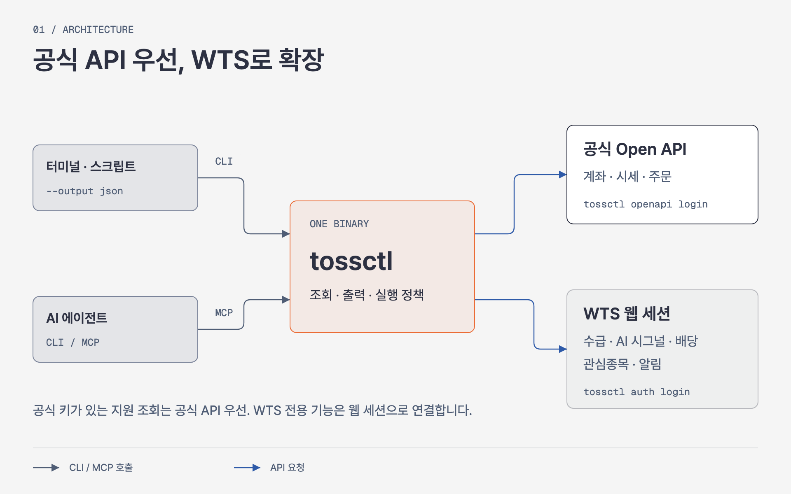
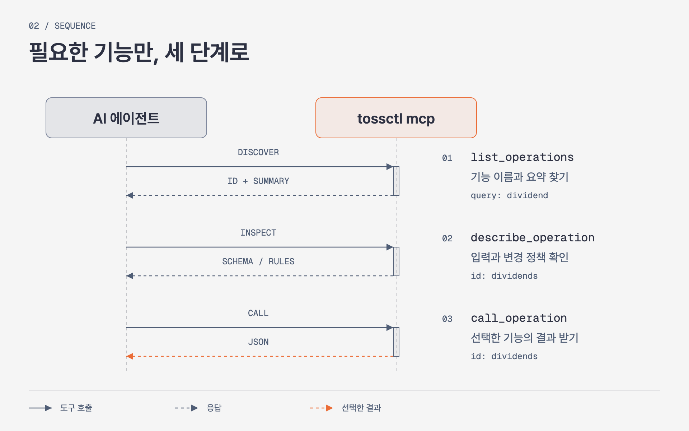
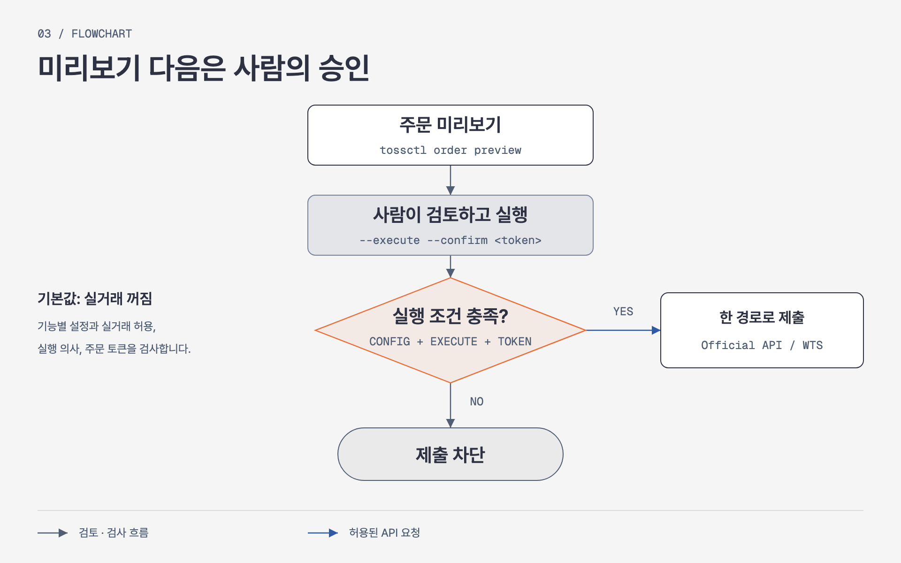

<p align="center">
  <a href="https://tossinvest-cli.vercel.app/"></a>
</p>

<p align="right"><strong>한국어</strong> · <a href="README.en.md">English</a></p>

<h1 align="center">tossinvest-cli</h1>

<p align="center">
  <strong>공식 API로는 못 보는 토스증권 데이터까지, CLI와 MCP로.</strong>
  <br />계좌·시세·주문에 수급·AI 시그널·배당·관심종목을 더하세요.<br />터미널, 스크립트, AI 에이전트에서 같은 <code>tossctl</code>로 사용합니다.
</p>

<p align="center">
  <a href="https://github.com/JungHoonGhae/tossinvest-cli/actions/workflows/ci.yml"></a>
  <a href="https://github.com/JungHoonGhae/tossinvest-cli/releases"></a>
  <a href="LICENSE"></a>
</p>

<p align="center">
  <a href="#빠른-시작"><strong>빠른 시작</strong></a> ·
  <a href="#왜-tossctl인가"><strong>왜 tossctl인가</strong></a> ·
  <a href="#cli와-mcp"><strong>CLI와 MCP</strong></a> ·
  <a href="#안전-모델"><strong>안전</strong></a> ·
  <a href="https://tossinvest-cli.vercel.app/docs"><strong>문서</strong></a>
</p>

> [!WARNING]
> 이 프로젝트는 토스증권 공식 제품이 아닙니다. 공식 Open API 외 기능은 토스증권 웹 내부 API를 비공식적으로 사용하며, 이용약관 위반에 해당할 수 있고 예고 없이 변경될 수 있습니다. 계좌 제한·손실 등 사용 결과는 사용자 본인의 책임입니다.

## 왜 tossctl인가?

**계좌와 주문을 넘어, 토스증권에서 보던 정보를 자동화에 연결합니다.** 공식 Open API에 없는 투자자 수급, AI 시그널, 배당 내역, 관심종목 관리까지 WTS(토스증권 웹 트레이딩 시스템) API로 제공합니다.

<p align="center">
  
</p>

공식 키가 있으면 지원되는 조회는 기본적으로 공식 API를 우선 사용합니다. WTS 기능은 웹 세션으로 연결합니다. 현재 지원 대상은 **토스증권**이며, 일반 토스뱅킹·카드 소비 내역은 지원하지 않습니다. [전체 기능 비교 →](https://tossinvest-cli.vercel.app/docs/reference/support-scope)

## 빠른 시작

macOS / Linux:

```bash
curl -fsSL https://raw.githubusercontent.com/JungHoonGhae/tossinvest-cli/main/install.sh | sh
tossctl auth login
tossctl account summary --output json
```

휴대폰 인증 후 **이 기기 로그인 유지**까지 승인하세요. QR 대신 링크를 쓰려면 `tossctl auth login --link`로 로그인합니다.

<details>
<summary>Windows · Homebrew · 공식 API 연결</summary>

Windows PowerShell에서 설치한 뒤 위의 로그인·조회 명령을 실행하세요.

```powershell
irm https://raw.githubusercontent.com/JungHoonGhae/tossinvest-cli/main/install.ps1 | iex
```

공식 Open API 키를 연결하려면:

```bash
tossctl openapi login
tossctl openapi status
```

Homebrew·소스 빌드는 [설치 문서](https://tossinvest-cli.vercel.app/docs/getting-started/installation), 인증·연결 문제는 `tossctl doctor --report`를 참고하세요.

</details>

## 이렇게 사용하세요

```bash
# 수급과 AI 시그널로 시장 살펴보기 — WTS 전용
tossctl quote flows A005930
tossctl market signals

# 배당과 전체 계좌 자산 모아보기 — WTS 전용
tossctl portfolio dividends
tossctl account overview

# 보유 종목을 스크립트로 넘기기
tossctl portfolio positions --output json

# 실시간 체결 구독과 API 변경 감시
tossctl stream --trade A005930
tossctl monitor api           # 85개 endpoint schema probe; 통과 0, 실패 1
```

관심종목 폴더·목표가 알림 관리, 조건검색, 거래 내역, 주문 미리보기도 제공합니다. 전체 사용법은 [명령 레퍼런스](https://tossinvest-cli.vercel.app/docs/reference/commands), 개별 옵션은 `tossctl <command> --help`에서 확인하세요.

보유 종목과 거래내역을 로컬에 저장해 비교하려면 `tossctl history sync`로 수집을 미리 확인하세요. 저장 후 `history list`, `history search`, `history compare`는 오프라인으로 동작합니다. `portfolio briefing`은 보유 종목 뉴스·어닝콜·미체결 주문을 함께 조회합니다. `--fields symbol,quantity --compact`로 필요한 JSON만 받을 수 있습니다. [로컬 이력·브리핑 가이드](https://tossinvest-cli.vercel.app/docs/guide/history)

## CLI와 MCP

터미널·스크립트에서는 CLI로, Claude Code·Codex·Cursor 같은 AI 에이전트에서는 MCP로 사용하세요. 별도 서버를 설치하지 않고 같은 바이너리에서 `tossctl mcp`를 실행합니다.

MCP의 기본 API 표면은 **117개 오퍼레이션**입니다. 에이전트는 `list_operations`로 기능을 찾고, `describe_operation`으로 입력 스키마와 변경 정책을 확인한 뒤, `call_operation`으로 호출합니다. 필요한 기능의 설명만 단계적으로 읽습니다.

<p align="center">
  
</p>

```bash
# Claude Code
claude mcp add tossctl tossctl mcp
```

<details>
<summary>다른 MCP 호스트 설정 · CLI에서 기능 탐색</summary>

MCP 호스트가 아래 형식의 설정을 지원하면 추가하세요. 호스트별 등록 방법은 [MCP 가이드](https://tossinvest-cli.vercel.app/docs/guide/mcp)를 참고하세요.

```json
{
  "mcpServers": {
    "tossinvest": { "command": "tossctl", "args": ["mcp"] }
  }
}
```

셸 기반 에이전트도 같은 카탈로그를 탐색할 수 있습니다.

```bash
tossctl ops list --query dividend
tossctl ops describe dividends
```

</details>

자세한 내용은 [AI 에이전트 가이드](https://tossinvest-cli.vercel.app/docs/guide/agents)와 [MCP 가이드](https://tossinvest-cli.vercel.app/docs/guide/mcp)를 참고하세요.

<details>
<summary>설치부터 첫 조회까지 — 데모</summary>

<p align="center">
  
</p>

</details>

<details>
<summary>AI 에이전트에 MCP 연결 — 데모</summary>

<p align="center">
  
</p>

</details>

## 안전 모델

> [!IMPORTANT]
> 실거래는 설치 직후 모두 꺼져 있습니다. 설정에서 해당 액션을 허용하더라도 실제 제출 전마다 미리보기와 확인 토큰이 필요합니다.

<p align="center">
  
</p>

```bash
tossctl order preview --symbol AAPL --side buy --qty 1 --price 200
# 미리보기만 실행합니다. 실제 주문은 사람이 결과와 확인 토큰을 검토한 뒤 진행하세요.
```

| 변경 종류 | 실행에 필요한 조건 | 실행 경계 |
|---|---|---|
| **실주문** | 사람이 주문별 승인 · 거래 설정 허용 · `--execute` · 미리보기의 `--confirm` 토큰 | CLI 일반 주문은 공식 API 또는 WTS 한 경로로 제출. MCP·`ops` 주문과 조건주문은 공식 API 전용 |
| **설정 변경** | 해당 변경 승인 · `--execute` · 현재 상태와 변경 내용에 묶인 `--confirm` 토큰 | 관심종목·목표가 알림 등. 되돌릴 수 없는 작업은 추가 확인 필요 |
| **모의투자** | 실험 기능 활성화 · 모의 원장 변경 승인 · `--execute` | 별도 모의 원장 사용. 실거래 승인으로 재사용 불가 |

주문 전송 결과가 불명확하면 주문 상태를 먼저 확인하세요. 실패한 주문을 다른 API 경로로 자동 재제출하지 않습니다.

전체 정책과 설정 예시는 [안전 가이드](https://tossinvest-cli.vercel.app/docs/guide/safety)와 [`docs/configuration.md`](docs/configuration.md)를 참고하세요.

<details>
<summary>실험적 기능 — 미국 옵션 모의투자</summary>

아직 안정화 중인 기능으로, 기본적으로 숨겨져 있습니다. `config.json`에 아래 설정을 추가하면 명령과 MCP 오퍼레이션에 나타납니다. 활성화해도 서버 측 이용 자격은 별도로 충족해야 합니다.

```json
{
  "experimental": {
    "paper_trading": true
  }
}
```

실험적 API는 변경될 수 있으며 실거래로 자동 승격되지 않습니다. 상태와 제한은 [지원 범위 문서](https://tossinvest-cli.vercel.app/docs/reference/support-scope)에 표시합니다.

</details>

## 문서

| 문서 | 내용 |
|---|---|
| [빠른 시작](https://tossinvest-cli.vercel.app/docs/getting-started/quickstart) | 설치 후 첫 조회까지 |
| [명령 레퍼런스](https://tossinvest-cli.vercel.app/docs/reference/commands) | 전체 CLI 명령과 예시 |
| [지원 범위](https://tossinvest-cli.vercel.app/docs/reference/support-scope) | 공식 API·WTS 기능 비교 |
| [설정](docs/configuration.md) | config 필드와 로컬 상태 |
| [운영](docs/operations.md) | 세션 갱신, API 변경 감시, 예약 실행과 알림 |
| [아키텍처](docs/architecture.md) | 라우팅·모듈·안전 경계 |
| [다이어그램 원본](diagrams/README.md) | README 그림의 HTML 원본과 이미지 재생성 방법 |
| [변경 내역](CHANGELOG.md) | 버전별 변경 사항과 기여자 크레딧 |

## 개발과 기여

로컬 빌드는 `make build`, 테스트는 `make test`로 실행합니다.

버그와 제안은 [Issues](https://github.com/JungHoonGhae/tossinvest-cli/issues), 변경 사항은 Pull Request로 보내주세요. 자세한 기준은 [`CONTRIBUTING.md`](CONTRIBUTING.md), 보안 문제는 [`SECURITY.md`](SECURITY.md)를 확인하세요.

## 후원

<p align="center">
  <a href="https://github.com/sponsors/JungHoonGhae"></a>
</p>

<!-- sponsors:start -->

<p align="center">
  <a href="https://github.com/sponsors/JungHoonGhae" title="비공개 후원자 / private sponsor"></a>
</p>

<p align="center"><sub>현재 <strong>1</strong>분이 제 오픈소스 작업을 후원하고 있습니다 (일회성 포함). 후원은 tossinvest-cli를 포함한 제 작업 전반에 쓰입니다.</sub></p>

<!-- sponsors:end -->

## Contributors

기여해 주신 모든 분께 감사합니다. 참여 방법은 [`CONTRIBUTING.md`](CONTRIBUTING.md)를 참고하세요.

[](https://github.com/JungHoonGhae/tossinvest-cli/graphs/contributors)

## Star History

<!-- star-history:start -->
<picture>
  <source media="(prefers-color-scheme: dark)" srcset="docs/assets/star-history/star-history-v2-dark.svg">
  
</picture>
<!-- star-history:end -->

## License

[MIT](LICENSE)
