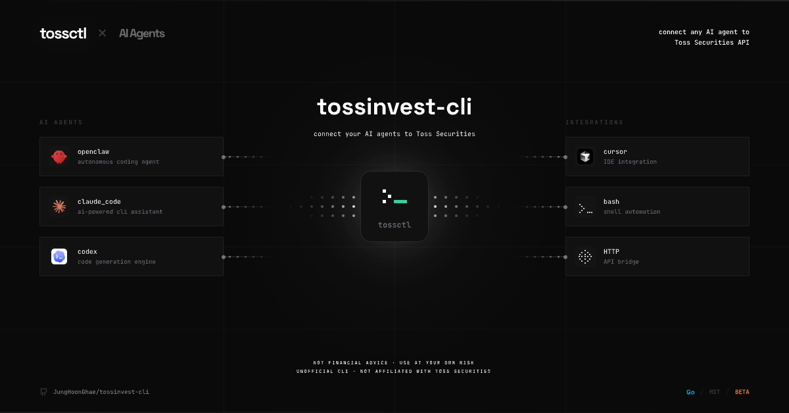
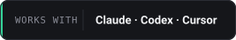
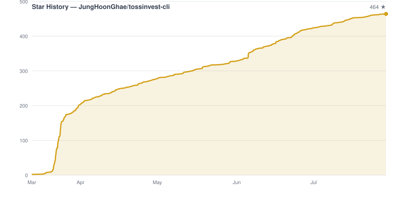
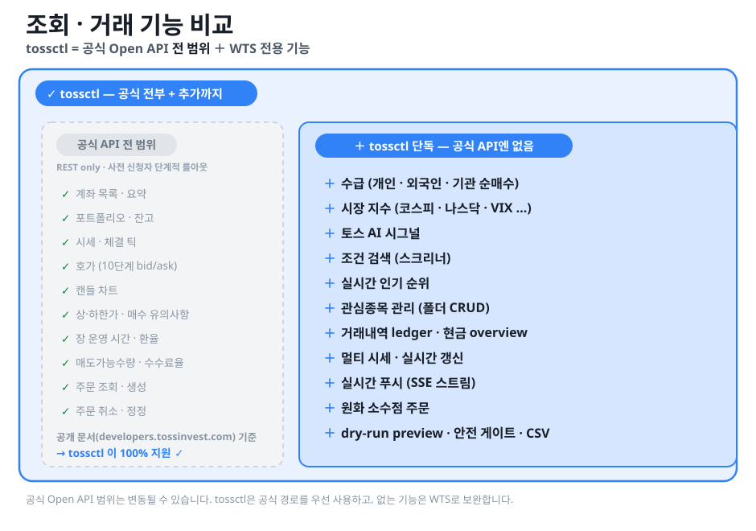
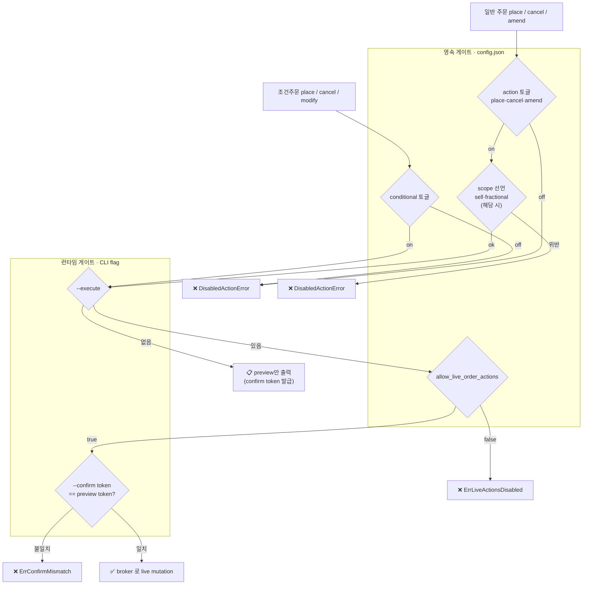
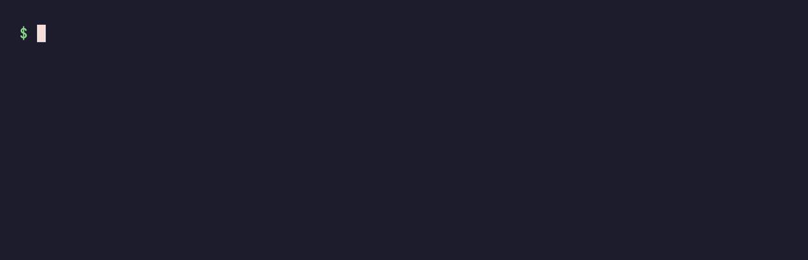

<p align="center">
  <a href="https://tossinvest-cli.vercel.app/"></a>
</p>

<p align="right"><strong>한국어</strong> · <a href="README.en.md">English</a></p>

<div align="center">
  <h1>tossinvest-cli</h1>
  <p><strong>토스증권에 연결하는 가장 유연한 방법. CLI 로, MCP 서버로, 어떤 AI 에이전트로든 — 공식 API는 물론 웹앱에만 있던 기능까지 하나로.</strong></p>
  <p>Claude Code · Codex · Gemini · Cursor · GitHub Copilot — 어떤 AI 에이전트로든 <code>tossctl</code> 하나로 토스증권 계좌·시세·거래를 다룹니다. <strong>MCP 서버(<code>tossctl mcp</code>)로 붙이거나 터미널에서 직접</strong>, <strong>공식 키 없이 바로 또는 연결 시 자동 라우팅.</strong></p>
  <p><sub>수급 · 시장지수 · AI 시그널 · 조건검색 · 관심종목 관리 · 거래내역 ledger · 실시간 푸시 · 원화 소수점 주문 · dry-run preview 등 공식 Open API에 없는 tossctl 고유 기능 58가지 — <strong>공식 Open API 지원 범위도 물론 100% 포함합니다.</strong> <a href="#지원-범위">전체 비교표 ↓</a></sub></p>
  <p><sub><em>The most flexible way to connect Toss Securities — via CLI, via MCP, from any AI agent. 100% of the official Open API, plus 58 tossctl-only capabilities.</em></sub></p>
</div>

<p align="center">
  
</p>

<p align="center">
  <sub>설치 한 줄 → QR 로그인 → 바로 조회. <a href="#빠른-시작"><strong>지금 시작 ↓</strong></a></sub>
</p>

<p align="center">
  <a href="LICENSE"></a>&nbsp;
  <a href="https://go.dev/"></a>&nbsp;
  
</p>

<p align="center">
  &nbsp;
  <a href="https://tossinvest-cli.vercel.app/docs/guide/hybrid-openapi"></a>
</p>

<p align="center">
  <a href="#빠른-시작"><strong>빠른 시작</strong></a> ·
  <a href="#지원-범위"><strong>지원 범위</strong></a> ·
  <a href="#명령-목록"><strong>명령 목록</strong></a> ·
  <a href="#faq"><strong>FAQ</strong></a> ·
  <a href="#문서"><strong>문서</strong></a> ·
  <a href="#후원"><strong>후원</strong></a>
</p>

<p align="center">
  <a href="https://github.com/JungHoonGhae/tossinvest-cli/stargazers"></a>
  <a href="https://github.com/JungHoonGhae/tossinvest-cli"></a>
  <a href="https://github.com/JungHoonGhae/tossinvest-cli/actions/workflows/ci.yml"></a>
</p>

> [!WARNING]
> 이 프로젝트는 토스증권 공식 제품이 아닙니다. 공식 Open API 키를 연결하면 해당 기능은 토스가 공식 지원하는 경로로 동작하지만, 그 외 기능은 토스 웹 내부 API를 비공식적으로 사용하며 이는 토스증권 이용약관(TOS) 위반에 해당할 수 있습니다. API는 예고 없이 변경될 수 있고, 사용으로 인한 계좌 제한·손실·기타 불이익에 대해 개발자는 어떠한 책임도 지지 않습니다. 본인의 판단과 책임 하에 사용하세요.

> [!IMPORTANT]
> 거래 기능은 설치 직후 모두 꺼져 있습니다. `config.json`에서 기능별로 직접 허용해야만 실행됩니다.

<div align="center">
<sub><strong>WORKS WITH</strong></sub>
<br /><br />
&nbsp;&nbsp;
<picture><source media="(prefers-color-scheme: dark)" srcset="docs/assets/logos/codex.svg" /></picture>&nbsp;&nbsp;
&nbsp;&nbsp;
<picture><source media="(prefers-color-scheme: dark)" srcset="docs/assets/logos/cursor.svg" /></picture>&nbsp;&nbsp;
<picture><source media="(prefers-color-scheme: dark)" srcset="docs/assets/logos/githubcopilot.svg" /></picture>&nbsp;&nbsp;
&nbsp;&nbsp;
&nbsp;&nbsp;
&nbsp;&nbsp;
&nbsp;&nbsp;
<picture><source media="(prefers-color-scheme: dark)" srcset="docs/assets/logos/moonshotai.svg" /></picture>&nbsp;&nbsp;

</div>

---

<p align="center">
  <a href="https://www.star-history.com/#JungHoonGhae/tossinvest-cli&Date">
    <picture>
      <source media="(prefers-color-scheme: dark)" srcset="docs/assets/star-history/star-history-dark.svg" />
      <source media="(prefers-color-scheme: light)" srcset="docs/assets/star-history/star-history-light.svg" />
      
    </picture>
  </a>
</p>

<p align="center">
  <a href="https://www.star-history.com/?repos=JungHoonGhae%2Ftossinvest-cli">
    <picture>
      <source media="(prefers-color-scheme: dark)" srcset="https://api.star-history.com/badge?repo=JungHoonGhae/tossinvest-cli&theme=dark" />
      <source media="(prefers-color-scheme: light)" srcset="https://api.star-history.com/badge?repo=JungHoonGhae/tossinvest-cli" />
      
    </picture>
  </a>
</p>

## 후원

<p align="center">
  <a href="https://github.com/sponsors/JungHoonGhae"></a>
</p>

<!-- sponsors:start -->

<p align="center">
  <a href="https://github.com/sponsors/JungHoonGhae" title="비공개 후원자 / private sponsor"></a>
</p>

<p align="center"><sub>현재 <strong>1</strong>분이 제 오픈소스 작업을 후원하고 있습니다 (일회성 포함). 후원은 tossinvest-cli 를 포함한 제 작업 전반에 쓰입니다.</sub></p>

<!-- sponsors:end -->

## 빠른 시작

**어떻게 쓸지에 따라 고르세요.**

- **AI 에이전트(Claude·Codex·Cursor…)로 쓴다** → **MCP 가 가장 간단합니다.** 한 번 등록하면
  (`claude mcp add tossctl tossctl mcp`) 에이전트가 자연어로 알아서 다룹니다. → [MCP 빠른 시작](#mcp-빠른-시작--3단계)
- **터미널·스크립트·자동화, 또는 전 기능(관심종목 등 WTS 쓰기·실시간 포함)** → **CLI.** 아래에서
  바로 시작하세요. ↓

둘 다 로그인 한 번이면 되고, 같은 `tossctl` 을 씁니다. 자세한 차이는 [CLI 와 MCP — 언제 무엇을](#cli-와-mcp--언제-무엇을-상호-보완).

### 에이전트용

```text
Install tossinvest-cli:
  curl -fsSL https://raw.githubusercontent.com/JungHoonGhae/tossinvest-cli/main/install.sh | sh
(macOS/Linux) or GitHub Releases (Windows).

Run `tossctl doctor` to verify setup, then complete browser login with
`tossctl auth login`. Use read-only commands first (account, portfolio, quote).
Trading actions stay disabled until config.json explicitly allows them.
Always run `tossctl order preview` before any trading mutation.
```

### 사람용

macOS / Linux:

```bash
curl -fsSL https://raw.githubusercontent.com/JungHoonGhae/tossinvest-cli/main/install.sh | sh
```

Windows (PowerShell):

```powershell
irm https://raw.githubusercontent.com/JungHoonGhae/tossinvest-cli/main/install.ps1 | iex
```

설치 확인:

```bash
tossctl version
tossctl doctor
tossctl auth login
tossctl account summary --output json
tossctl account overview                 # 전체 계좌 합산 (번호 기본 마스킹)
```

설치 후 새 버전이 나오면 `tossctl update` 로 갱신할 수 있습니다 (Homebrew로 설치했다면 `brew upgrade tossctl` 로 자동 위임됩니다).

> `auth login`에는 Google Chrome과 Python이 필요하며, 설치 스크립트가 자동으로 설정합니다.
> Windows, Homebrew, 소스 빌드 등 다른 설치 방법은 [설치](#설치) 섹션을 참고하세요.
>
> QR 스캔 후 폰에 뜨는 **"이 기기 로그인 유지"** 확인 프롬프트까지 꼭 눌러주세요.
> 이 2차 확인을 건너뛰면 세션이 약 1시간 idle 후 만료되어 재로그인이 필요해집니다.
> 정상 캡처 여부는 `tossctl auth status` 의 `Persistence: persistent cookie (expires ...)` 로 확인할 수 있습니다.

> **링크 로그인:** `tossctl auth login --link`. 출력된 URL 을 폰에서 탭하면 카메라 없이 Toss 앱이 열립니다. 확인 문자를 고른 뒤 **“이 기기 로그인 유지”**까지 승인하세요.
> GUI 없는 환경의 기존 `--headless`도 같은 동작이며, QR 파일이 필요하면 `--qr-output /tmp/toss-qr.png`를 함께 사용합니다. 파일은 `0600` 권한으로 저장됩니다.

### 세션 연장

토스 서버는 SESSION 쿠키(1년 `Max-Age`)와 별개로 약 7일짜리 활성 만료 시계를 운영합니다. 만료 24시간 전부터 모든 명령에 다음과 같은 stderr 경고가 표시됩니다.

```
⚠ session expires in ~18h; run `tossctl auth extend` to renew
```

`tossctl auth extend` 는 폰의 토스 앱에 푸시를 보내고 승인을 기다립니다.

```
$ tossctl auth extend
Waiting for approval in the Toss app on your phone...
✓ Extension complete. New expiry: 2026-05-13 07:03 KST (took 4s)
```

기본 timeout 은 120초이며 `--timeout 60s` 처럼 단축할 수 있습니다.

#### 만료되기 전에 자동으로 챙기기

폰 승인은 토스의 2차 인증이라 없앨 수 없지만, **언제 승인을 요청할지**는 자동화할 수 있습니다.
`--if-expiring` 은 서버에 남은 시간을 먼저 확인해서, 지정한 창보다 여유가 있으면 아무것도
하지 않고 그대로 끝납니다(exit 0). 스케줄러에 걸어두면 만료가 임박한 날에만 폰 알림이 옵니다.

```bash
tossctl auth extend --if-expiring 48h   # 48시간 이내면 연장, 아니면 no-op
```

macOS launchd 예시 — 매일 09:00 에 확인:

```xml
<!-- ~/Library/LaunchAgents/com.tossctl.extend.plist -->
<key>ProgramArguments</key>
<array>
  <string>/opt/homebrew/bin/tossctl</string>
  <string>auth</string><string>extend</string>
  <string>--if-expiring</string><string>48h</string>
</array>
<key>StartCalendarInterval</key>
<dict><key>Hour</key><integer>9</integer><key>Minute</key><integer>0</integer></dict>
```

`launchctl load ~/Library/LaunchAgents/com.tossctl.extend.plist` 로 등록합니다.
cron 이면 `0 9 * * * /opt/homebrew/bin/tossctl auth extend --if-expiring 48h`.

> 값은 Go duration 표기입니다 — `7d` 는 안 되고 `168h` 로 씁니다.

## 지원 범위

> **tossctl 은 토스 공식 Open API 의 조회·거래 범위를 100% 커버하고, 그 너머까지 다룹니다.**
> 공식 [Open API 문서](https://developers.tossinvest.com/docs)의 모든 엔드포인트(계좌·잔고·시세·호가·체결·캔들·상하한가·매도가능수량·수수료·주문 등)에 대응하며, 추가로 수급·시장지수·AI 시그널·조건검색·관심종목 관리·거래내역 ledger·실시간 푸시·원화 소수점 주문·dry-run preview 등 **58개가 공식 Open API에 없는 tossctl 고유 범위**입니다.

<p align="center">
  
</p>

토스증권 공식 Open API 는 현재 **사전 신청자 대상으로 단계적 롤아웃** 중이며, REST only 의
좁은 범위입니다 (공식 문서: <https://developers.tossinvest.com/docs>). 아래 표의
`공식 API (예정)` 칼럼은 그 문서 기준 공식이 커버하는 범위이고, `tossctl` 칼럼은 우리가
제공하는 범위입니다. **공식 Open API의 ✅ 행은 tossctl 도 전부 ✅ — 즉 공식 Open API 범위를 100% 커버합니다.**

### 기능 영역과 접근 경로는 다릅니다

`증권`·`뱅킹`·`MyData`는 **기능 영역**이고, `공식 Open API`·`WTS`·`mobile`은
**접근 경로**입니다. `플랫폼`이라는 별도 기능 영역은 두지 않습니다.

| 기능 영역 | 실제 화면/API | tossctl 상태 |
|---|---|---|
| 토스증권 | 공식 Open API, 웹 트레이딩 시스템(WTS), 일반 Toss 앱 안의 증권 모바일 화면(MTS 성격) | 공식 + WTS 구현 |
| 일반 Banking | 일반 Toss 앱의 은행 화면/모바일 API. 대응하는 WTS 웹앱 없음 | 모바일 인증 connector가 없어 미구현 |
| MyData | 일반 Toss 앱의 카드·소비·외부 금융자산 모바일 API | 계약 일부 정적 확인, 미구현 |
| 시스템 | 로그인, Open API 허용 IP, API·앱 변경 감시 | 구현 |

따라서 정식 명령 `accumulate funding-status`는 **토스증권 주식모으기 자금연결
상태(`securities + wts`)**입니다. 이전 `banking status`는 호환용 deprecated alias입니다. 자동주문용 오픈뱅킹 등록도 이 좁은 증권 흐름의
플래그이며 일반 Banking 조회가 아닙니다. 카드 결제 내역·이번 달 소비·은행 거래는 같은 Toss 앱에
보이더라도 별도 모바일 토큰·동의 범위를 확인하기 전에는 WTS 쿠키로 추측 호출하지 않습니다.

- ✅ 지원 · ❌ 미지원 · 🔸 부분 지원 · 🆕 최근 한 달 내 새로 추가된 기능
- **`공식 API (예정)` 칼럼 = 공개 문서 기준 예상 커버리지** (사전 신청자 단계적 롤아웃 — 변동 가능).
- **`공식 API (예정)` 가 ❌ 인 행 = tossctl 고유 범위.**
- **검증 기준 버전**: 아래 표·다이어그램의 `공식 API` 칼럼은 **상단 배지에 표시된 공식 Open API 버전** 기준으로 검증된 결과입니다 (그 버전·마지막 점검일은 [`.openapi-snapshot.json`](docs/migration/.openapi-snapshot.json) 에 기록). 전체 spec 사본을 매일 [`docs/migration/openapi.latest.json`](docs/migration/openapi.latest.json) 에 미러링하며, 토스가 spec 을 올리면 자동 감지·알림되어 갱신됩니다.

### 조회 (읽기 전용) · US·KR 공통

| 기능 | 커맨드 | 공식 API (예정) | tossctl |
|------|--------|:--:|:--:|
| 계좌 목록 / 요약 | `account list`, `account summary` | ✅ | ✅ |
| 🆕 매수여력 (공식) | `account buying-power [--currency KRW\|USD]` (현금 기준, 계좌요약과 다른 개념) | ✅ | ✅ |
| 포트폴리오 | `portfolio positions`, `portfolio allocation` (US: USD 병기) | ✅ | ✅ |
| **🆕 포트폴리오 폴더** | `portfolio folders [--account]` (토스증권 앱과 같은 폴더·보유종목 구성, 읽기 전용) | ❌ | ✅ |
| **🆕 포트폴리오 평가 이력** | `portfolio performance`, `portfolio snapshots`, `portfolio snapshot <date>` (전체 계좌 합산 기본, `--account` 선택; 웹 UI 없는 증권 WTS 읽기) | ❌ | ✅ |
| 체결 내역 (틱) | `quote trades <symbol> --count N` | ✅ | ✅ |
| 호가 (bid/ask 10단계) | `quote orderbook <symbol>` (매도·매수 잔량) | ✅ | ✅ |
| 상/하한가 | `quote limits <symbol>` (KR) | ✅ | ✅ |
| 매수 유의사항 | `quote warnings <symbol>` (정리매매·투자경고·VI 등) | ✅ | ✅ |
| 장 운영 시간 | `market hours` (오늘 + 휴장 시 다음 영업일) | ✅ | ✅ |
| 🆕 거래일 캘린더 | `market business-days <KR\|US>` (전일·오늘·익일 세션 시각, 국내 단일가 포함) | ✅ | ✅ |
| 환율 | `market fx` (달러 환율·달러 인덱스) | ✅ | ✅ |
| 🆕 서킷브레이커·사이드카 | `market halt` (코스피·코스닥 발동 여부) | ❌ | ✅ |
| 🆕 지수 이상 움직임 | `market anomalies` (AI 시그널·키워드·Z점수) | ❌ | ✅ |
| 🆕 AI 사유 일괄 조회 | `quote reasons <symbols...>` (최대 100종목 1회 호출) | ❌ | ✅ |
| 🆕 분봉 일괄 조회 | `quote charts <symbols...>` (여러 종목 당일 캔들 1회 호출) | ❌ | ✅ |
| 매도가능수량 | `quote sellable <symbol>` (보유 종목 매도가능 주수) | ✅ | ✅ |
| 수수료 / 거래세율 | `quote commission <symbol>` (수수료율·거래세율) | ✅ | ✅ |
| 미체결 / 체결 / 단건 주문 | `orders list`, `orders completed`, `order show <id>` | ✅ | ✅ |
| 시세 | `quote get <symbol>` (OHLC·52주 고저·시총·거래대금·체결강도) | 🔸 *(체결강도·52주 등 제외)* | ✅ |
| 캔들 차트 | `quote chart --interval 1m\|3m\|5m\|10m\|15m\|30m\|60m` | 🔸 *(1분·일봉만)* | ✅ |
| **멀티 시세 / 실시간 갱신** | `quote batch <sym>[,sym,...]` (`--chart`·`--live`) | ❌ | ✅ |
| **🆕 종목 메타데이터 일괄 조회** | `quote metadata <sym>[,sym,...]` (ISIN·시장·유형·상장 상태·상장주식수, 최대 200개) | ✅ | ✅ |
| **🆕 가상자산 시세 + 김프** | `quote crypto BTC,ETH,SOL,XRP` (OHLC·52주·김치 프리미엄) | ❌ | ✅ |
| **🆕 마켓 전체 종목 (유니버스)** | `market stocks KOSPI\|NASDAQ\|…` (필터: `--status`·`--security-type`·`--common-share`) | ✅ | ✅ |
| **🆕 종목 수급 (5종)** | `quote supply <symbol> --type investor\|short\|credit\|lending\|program` | ✅ | ✅ |
| **🆕 스크리너 필터 값 범위** | `market filters PER PBR --nation kr\|us` (min/max·기준일) | ❌ | ✅ |
| **🆕 미국 옵션 만기·체인** | `quote options <symbol> [--expiry]` (행사가별 콜/풋 미결제약정) · 계약 코드는 `quote get`·`orderbook`·`chart` 에 그대로 사용 | ❌ | ✅ |
| **🆕 종목 등락 이유 (AI)** | `quote reasoning <symbol>` (왜 올랐는지 + 관련 종목) | ❌ | ✅ |
| **🆕 종목별 시그널** | `quote signals <symbol>` (호재/악재 카드) | ❌ | ✅ |
| **🆕 통합 검색** | `search <이름\|티커>` (종목 코드 조회) | ❌ | ✅ |
| **🆕 미수금·반대매매 통지** | `account receivable --currency KRW\|USD` | ❌ | ✅ |
| **수급 (투자자별 순매수)** | `quote flows <symbol>` (개인·외국인·기관, KR) | ❌ | ✅ |
| **시장 지수** | `market index` (코스피·코스닥·나스닥·S&P500·VIX), `market index <코드\|이름>` 상세(OHLC·52주·시세원·거래 세션) | ❌ | ✅ |
| **실시간 인기 순위** | `market ranking --size N` | ❌ | ✅ |
| **공식 랭킹(거래대금/등락률)** | `market rankings --type ... --market KR --duration 1d` | ✅ | ✅ |
| **시장 지표 현재가** | `market indicator KOSPI,KOSDAQ` | ✅ | ✅ |
| **시장 지표 캔들** | `market indicator-candles KOSPI --interval 1d` | ✅ | ✅ |
| **시장 투자자별 매매동향** | `market investor-trading KOSPI --interval 1d` | ✅ | ✅ |
| **조건주문 조회** | `order conditional list`, `order conditional get <id>` | ✅ | ✅ |
| **조건주문 거래** | `order conditional place\|cancel\|modify` (안전 게이트: config 허용 + --execute + --confirm) | ✅ | ✅ |
| **투자자별 순매수 상위** | `market investors` (외국인·기관·개인 순매수 상위) | ❌ | ✅ |
| **실적(어닝콜) 일정·상세** | `market earnings [event-id]` (`--major` 주요 기업 큐레이션, ID 지정 시 보고서·오디오·대본·발표자료 링크) | ❌ | ✅ |
| **배당 내역** | `portfolio dividends` (연간 총액·지역·월별, `--by-payment-date` 세금) | ❌ | ✅ |
| **누적 실현손익** | `profit` (매매손익·배당·대여·만기·예탁금이자, KRW/USD — account summary 와 다른 누적 관점) | ❌ | ✅ |
| **계좌 상세** | `account detail [--full]` (계좌번호·개설일 + **출금 가능액/한도** + 미수거래 상태 + **미국 배당 수령 방식** — 번호·이름은 기본 마스킹) | ❌ | ✅ |
| **🆕 전체 계좌 자산** | `account overview [--full]` (일반·미성년 계좌별 자산과 미체결 주문 수 — 번호는 table/JSON/CSV 모두 기본 마스킹) | ❌ | ✅ |
| **🆕 증권 거래 설정 조회** | `account trading-settings [--account <key>]` (계좌별 간편주문 + 사용자 공통 KRX/NXT 체결시장·ATS 알림·옵션 실시간 시세 상태, 읽기 전용) | ❌ | ✅ |
| **🆕 증권 주식이체 계좌 조회** | `account transfer-accounts [--account <key>] [--full]` (내 계좌·최근 목적지 계좌, 번호 기본 마스킹; 이체 실행 없음) | ❌ | ✅ |
| **🆕 계좌 접속·제한 상태** | `account access-status [--account <key>]` (최근 접속 환경, 신용거래 동결 여부·기간, 사고계좌 수; 읽기 전용) | ❌ | ✅ |
| **자동매매 조회** | `order autotrade` (스탑로스·목표수익·OCO·OTO 설정과 감시가/주문가 — 조회 전용) | ❌ | ✅ |
| **시장 뉴스** | `market news [--type all\|watchlist\|holdings\|soaring\|latest\|recommended] [--limit N] [--full]` (기사별 **관련 종목 등락률** 포함 — 헤드라인 목록에 없는 부분) | ❌ | ✅ |
| **시장 이슈 랭킹** | `market issues [--full]` (지금 가장 많이 이야기되는 토픽 순위 + 등락 ▲▼ + 관련 기사) | ❌ | ✅ |
| **증시 캘린더** | `market calendar [--month YYYY-MM]` (경제지표 **예상치·실제치·직전값** + 국내·미국 **실적 발표**(종목/시각) + 휴장일, 월 단위) | ❌ | ✅ |
| **기간별 실현손익** | `profit summary --type sales\|dividend\|lending\|account-interest [--from --to]` (카테고리 하나의 수익금·수익률·매입금액, KRW/USD) | ❌ | ✅ |
| **종목별 일자별 실현손익** | `profit daily [--from --to] [--currency KRW\|USD]` (종목·수량·손익·수익률·매도/매수 금액, 전체 페이지 병합 — 세금 준비용 CSV) | ❌ | ✅ |
| **해외 양도소득(세금)** | `tax overseas --year YYYY` (양도소득세 신고용: 세율·공제·종목별 손익) | ❌ | ✅ |
| **예상 대여수익** | `lending expected` (주식대여 예상 수익: 월/연 USD + 종목별) | ❌ | ✅ |
| **주식대여 수익 랭킹** | `lending top [--size N]` (익명 사용자별 누적 수익 상위) | ❌ | ✅ |
| **🆕 인기 라운지** | `community boards` (팔로워 순 커뮤니티 라운지·댓글 수·참여 여부) | ❌ | ✅ |
| **🆕 미국 옵션 거래시간** | `market option-hours` (직전·오늘·다음 영업일 세션) | ❌ | ✅ |
| **🆕 매수 여력 부족분** | `order funding` (매수 가능 여부·필요 입금액·필요 환전액) | ❌ | ✅ |
| **🆕 예탁금 이용료(예수금 이자)** | `account interest --year YYYY` (지급 건별: 세전액·세금·실지급액·산정기간·예상 여부) | ❌ | ✅ |
| **🆕 계좌 수수료 체계** | `account commission` (국내주식·미국주식 수수료율, 미국옵션 계약당 수수료, 우대 적용 여부) | ❌ | ✅ |
| **Prime 구독 상태·혜택** | `account prime` (수수료·이자 3단 비교: 일반/Prime/내 적용) | ❌ | ✅ |
| **커뮤니티 랭킹** | `community rankings --type influencer\|profit\|followers` | ❌ | ✅ |
| **업종별 등락·상세** | `market sectors [id]` (업종 트리·등락), `market sector <id>` (현재 등락·연관 업종 + 종목·ETF·뉴스 첫 페이지와 전체 건수) | ❌ | ✅ |
| **테마 등락 랭킹** | `market themes` (오늘 가장 많이 오른 테마, 상승종목 수) | ❌ | ✅ |
| **AI 뉴스 브리핑** | `market briefing [--scope personalized\|kr\|us]` (개인화 또는 한국·미국 최신 브리핑) | ❌ | ✅ |
| **🆕 핵심 실적·경제지표** | `market key-events` (실적 예상·발표·서프라이즈, 경제지표 실제·예상·직전값) | ❌ | ✅ |
| **🆕 증권 주식모으기 자금연결 상태** | `accumulate funding-status [--full]` (`banking status`는 deprecated alias; 일반 Banking 아님, 예금주·계좌번호 기본 마스킹) | ❌ | ✅ |
| **🆕 알림 설정·상태 조회** | `notifications list`, `notifications status` (통합 알림 설정·받은함 미확인·AI 분석 동의; 읽기 전용, 내부 사용자 ID 제외) | ❌ | ✅ |
| **🆕 목표가 알림 조회·관리** | `quote alert list\|add\|remove <symbol>` (변경은 preview + `--execute --confirm`) | ❌ | ✅ |
| **🆕 숨긴 보유종목 조회·관리** | `portfolio hidden list\|hide\|show` (계좌 키 비노출, 변경 후 재검증) | ❌ | ✅ |
| **토스 AI 시그널** | `market signals` (목록), `market signal <symbol>` (전체 근거·뉴스·연관 종목) | ❌ | ✅ |
| **조건 검색 (스크리너)** | `market screener [id]` (프리셋) · `--filter '<json>'` (커스텀 조건) `--nation kr\|us` | ❌ | ✅ |
| **🆕 관심 종목 조회·관리** | `watchlist list [<group-id>] [--all]`·`groups`, `watchlist group create\|rename\|delete`, `watchlist add\|remove --group <id>` (폴더별 조회 + CRUD + 종목 추가/제거) | ❌ | ✅ |
| **거래내역 ledger** | `transactions list --market us\|kr` (매매·입출금·배당·입출고) | ❌ | ✅ |
| **현금 overview** | `transactions overview --market us\|kr` (주문가능·출금가능·예정입금) | ❌ | ✅ |
| **CSV 내보내기** | `export positions\|orders --market`, `transactions list --output csv` | ❌ | ✅ |
| **실시간 푸시** | `push listen` (SSE 스트림 — 주문/가격 변경 알림) | ❌ *(공식 API 는 웹소켓)* | ✅ |
| **🆕 실시간 스트림 (웹소켓)** | `stream --trade\|--orderbook\|--order` (체결·호가·본인 주문 이벤트) | ✅ | ❌ *(웹은 SSE 알림뿐)* |

`quote charts` 와 `quote reasons` 는 서버가 데이터 없는 종목을 응답에서 생략해도 요청 순서를
유지합니다. JSON 의 `missing` 배열은 생략된 입력 종목을 담고, CSV 에서는 해당 종목을 `symbol` 만
채운 빈 행으로 기록합니다. 정상 응답에 캔들이 0개인 종목도 빈 시계열 행으로 남습니다. 따라서
자동화는 응답 행 수가 요청 수와 같다고 가정하지 말고 `missing` 또는 빈 CSV 열을 확인해야 합니다.

#### 📱 증권 모바일 화면에서 발견한 WTS 호출 가능 기능 (웹 UI 없음)

위 표의 대부분은 **토스증권 웹(WTS)에 화면이 있는** 기능입니다. 아래 기능은 일반 Toss 앱의
증권 모바일 화면에서 발견했지만, 호출 계약은 현재 **증권 WTS 세션으로 별도 검증된 것**입니다.
일반 Banking/MyData 모바일 API를 WTS로 호출한다는 뜻이 아닙니다.

| 기능 | 커맨드 | 모바일 앱 | 웹(WTS) | tossctl |
|------|--------|:--:|:--:|:--:|
| **🆕 RIA 절세 리포트** | `tax ria` (해외주식 양도세 절세 계좌: 공제 전/후 세액·절세액·분기 가중 손익·매도한도) | ✅ | ❌ (UI 없음) | ✅ (조회) |
| **주식모으기 조회** | `accumulate list`, `accumulate status <symbol>` (정기 자동매수: Active/Paused·금액·주기·완료 회차) | ✅ (설정 화면) | ❌ (UI 없음) | ✅ (조회) |
| **미국 배당 수령 방식** | `account detail` 의 «미국 배당» 항목 (`CASH` 현금 수령 / `STOCK` 주식 재투자 + 변경일) | ✅ (설정 화면) | ❌ (UI 없음) | ✅ (조회) |

> 웹 UI 유무는 발견·분류 정보일 뿐 API 호출 가능 여부의 기준이 아닙니다. 이 항목들은
> WTS 호출 계약을 별도로 검증했으므로 웹 UI가 없어도 `source=wts`로 유지됩니다.

### 거래

공식 API 도 주문 생성·정정·취소·소수점 주문(`orderAmount` 금액 기반 매수, 1.1.5부터 US 시장가 소수점 매도)을 제공합니다. 다만 **원화(KRW) 결제 모드의 소수점 주문·dry-run preview·config 기반 안전 게이트** 등 tossctl 의 거래 UX/안전장치는 우리 고유입니다.

| 기능 | 커맨드 | 필요 config | 공식 API (예정) | tossctl |
|------|--------|-------------|:--:|:--:|
| 지정가 매수 (US/KR) | `order place --side buy --price <value>` | `place` | ✅ | ✅ |
| 지정가 매도 (US/KR) | `order place --side sell --price <value>` | `place` + `sell` | ✅ | ✅ |
| 국내주식 거래 | `order place --market kr` (6자리 코드는 자동 인식) | `place` | ✅ | ✅ |
| 🆕 시가단일가·장마감 주문 | `order place --time-in-force OPG\|CLS` (OPG=국내 시가단일가, CLS=미국 LOC) | `place` | ✅ | ❌ |
| 주문 취소 | `order cancel --order-id <id>` | `cancel` | ✅ | ✅ |
| 주문 정정 | `order amend --order-id <id>` | `amend` | ✅ | ✅ |
| 소수점 매수 (US, 금액 기반) | `order place --fractional --amount <value>` (`--currency-mode USD`) | `place` + `fractional` | ✅ | ✅ |
| **소수점 매수 — 원화(KRW) 결제** | `order place --fractional --amount <value>` (기본 KRW) | `place` + `fractional` | ❌ | ✅ |
| **주문 dry-run / preview** | `order preview` (실제 전송 없이 검증) | — | ❌ | ✅ |

모든 거래는 `allow_live_order_actions=true`도 필요합니다. 소수점 주문은 시장가(market order)로 자동 전환되며, 금액 기반입니다 (`--currency-mode KRW` 기본 또는 `USD`).

> ⏰ **소수점 주문 접수 시간** — 금액 주문과 소수점 수량 주문은 **정규장 종료 1시간 전까지만** 접수됩니다(정규장 종료 시각이 아닙니다). 그 뒤에는 서버가 `422` 로 거절합니다. 토스 공식 Open API 1.2.9 에서 좁혀진 규칙입니다.

US 지정가는 `--currency-mode`로 가격 해석을 선택합니다: `KRW` (기본, 서버 환율로 USD 변환) 또는 `USD` (입력을 USD 가격 그대로 전송). 예: `order place --symbol MRVL --side buy --qty 1 --price 158.01 --currency-mode USD`.

> 💵 **지정가는 호가 단위에 맞아야 합니다** — 미국은 **$1 미만이면 0.0001, $1 이상이면 0.01** 단위입니다(국내는 가격대별 구간 단위, 예: 5만~20만원은 100원). 어긋나면 서버가 `400 invalid-request` 와 함께 가장 가까운 호가를 `data.nearestPrices` 로 알려줍니다. tossctl 은 가격을 그대로 전송하므로 이 검증은 서버에서 이뤄집니다.

### 왜 tossctl 인가 — 공식 API 는 토스 기능의 일부일 뿐

공식 Open API 는 **REST 조회·주문의 기본만** 제공합니다 (약 20개 엔드포인트). 반면
토스 웹앱(WTS)이 실제로 쓰는 **의미있는 조회·거래 endpoint는 현재 487개** — 온보딩·KYC·약관·
프로모션·텔레메트리 같은 무의미한 엔드포인트는 뺀 숫자입니다.

> **공식 Open API 는 그중 약 4%만 커버합니다.** tossctl 은 나머지 범위 위에서 동작하며,
> 공식 Open API에 없는 기능(수급·시장지수·AI 시그널·스크리너·투자자별 순매수·어닝콜·배당 내역·
> 커뮤니티 랭킹·업종별 등락·뉴스 브리핑·실시간 푸시·원화 소수점 주문·dry-run preview 등)을 이미 제공하고,
> **남은 의미있는 범위를 계속 구현해 나갑니다.**

#### 실전 시나리오 — 공식으로 막히는 것, tossctl 로 되는 것

추상적인 "범위가 넓다"가 실제로 무슨 차이인지. **공식만으로는 ❌ → tossctl(WTS 포함)이면 ✅**:

| 하고 싶은 것 | 공식 Open API | tossctl |
|---|:---:|---|
| **특정 종목으로 지금까지 실제 얼마 벌고 잃었나(실현손익)** | ❌ 체결단가 없음 | ✅ `completed_orders` 로 전 기간 매수·매도 체결가 집계 |
| **연도별 배당·원천세 내역 → 금융소득종합과세 대상 판단** | ❌ | ✅ `dividends` (세전/세후·월별) |
| **해외주식 양도세·양도차손 통산 신고자료** | ❌ | ✅ `transactions` + `completed_orders` 로 원장 구성 |
| **월별 배당 현금흐름(받은 것 + 예정)** | ❌ | ✅ `dividends` monthly |
| **종목별 투자자(개인/외국인/기관) 순매수 흐름** | ❌ 체결량까지만 | ✅ `trading_flows` |
| **코스피·코스닥·VIX 등 지수** | ❌ 개별 종목만 | ✅ `market_indices` / `index_detail` |
| **오늘 외국인·기관이 담은 종목 top** | ❌ | ✅ `investor_rankings` |
| **섹터·테마 등락 스캔(무엇이 움직이나)** | ❌ | ✅ `sectors` / `theme_rankings` |
| **조건검색(고배당·저PBR·성장)** | ❌ | ✅ `screener_presets` |
| **실적발표(어닝콜) 일정·상세** | ❌ | ✅ `earning_calls` / `earnings_major` / `earning_call_detail` |
| **총자산·평가손익을 한 화면에** | △ `holdings`+`buying_power` 조합 | ✅ `account_summary` 한 번에 |
| **공식 키 없이 보유·대기주문 조회** | ❌ 키 필요 | ✅ `positions` / `pending_orders` (웹 세션만으로) |
| **커버드콜 ETF 진짜 총수익(배당 − NAV손실)** | ❌ | ✅ `completed_orders` + `dividends` 결합 |
| **매수 후 그 종목에 수급이 어땠나 사후분석** | ❌ | ✅ `completed_orders` + `trading_flows` 결합 |

> 요컨대 공식은 *"아는 종목을 정밀 조회하고 주문을 넣는다"* 까지. tossctl 은 여기에 **내 계좌의 실현손익·배당·세금 복기 + 시장 수급·지수 맥락 + 발굴·스크리닝**을 더해, 단순 조회/거래 도구를 **세무·수급·리서치가 붙은 종합 분석 도구**로 확장합니다. 전체 매핑은 [자동 라우팅 가이드 ↗](https://tossinvest-cli.vercel.app/docs/guide/hybrid-openapi) 참고.

장기적으로 tossctl 이 더 나은 이유:

- **유연성 — 토스증권에 연결하는 방법이 가장 열려 있습니다.** 터미널 CLI 로, [MCP 서버](#mcp-서버-tossctl-mcp)로 어떤 AI 에이전트(Claude Code·Codex·Gemini·Cursor·Copilot)에든, 스크립트로 — 전부 **하나의 `tossctl`** 이 처리합니다. **공식 키 없이 바로 시작**하고, 연결하면 공식 경로로 **자동 라우팅**. 특정 앱·SDK·언어·에이전트에 묶이지 않습니다.
- **범위** — 공식 Open API는 좁은 영역을 단계적으로 천천히 엽니다. tossctl 은 웹 전체(아래 카탈로그)를 추적해 골라 구현하므로 항상 더 넓습니다.
- **속도** — 증권 기능은 WTS와 모바일 증권 화면에 먼저 통합되고 공개 API에는 안정적인 일부만 뒤따를 수 있습니다. 일반 Banking/MyData는 WTS가 아니라 별도 모바일 경로입니다. tossctl 은 WTS build·endpoint와 일반 Toss Android 버전을 함께 감시해 **접근 경로를 섞지 않고** 검증된 계약만 구현합니다. [왜 공식 API가 늦는지 ↗](https://tossinvest-cli.vercel.app/docs/guide/hybrid-openapi)
- **상위호환** — 공식 Open API가 커버하는 범위는 [이미 100% 지원](#지원-범위)합니다 (공식 Open API가 따라와도 우리가 앞섭니다).
- **안정성(복원력)** — 공식 Open API 는 엔드포인트 그룹별 초당 1~10회로 제한됩니다(계좌 조회가 **초당 1회**로 가장 빡빡). 빠르게 반복하면 10번 중 8번이 막혀요(실측 3개 시점). tossctl 은 막히면 **곧바로 웹 세션으로 우회**해 데이터를 가져오므로 사용자는 막힌 줄도 모르고 항상 성공합니다 — 자동매매·대시보드처럼 계속 불러야 할 때 차이가 큽니다. (한도 숫자는 토스 정책에 따라 바뀔 수 있어도 '막히면 우회'하는 구조는 그대로.) [공식 한도 표 + 실측 ↗](docs/migration/open-api.md#rate-limit-실측)

#### WTS 웹 API 카탈로그 (지속 추적)

웹 번들에서 모든 `/api/*` 엔드포인트를 추출해 **구현됨 / 다음 추가 후보 / 의도적 제외**로 분류하고, 추가·변경·삭제를 주간 모니터가 감지합니다. (배지 숫자는 **무의미한 엔드포인트를 제외한 의미있는 범위** 기준이며 카탈로그에서 자동 갱신)

<p align="center">
  <a href="docs/reverse-engineering/wts-endpoints.json"></a>
  <a href="docs/reverse-engineering/wts-endpoints.json"></a>
  <a href="docs/reverse-engineering/wts-endpoints.json"></a>
  
</p>

- **분류** (전체 카탈로그: [`docs/reverse-engineering/wts-endpoints.json`](docs/reverse-engineering/wts-endpoints.json)):
  - `implemented` — tossctl 이 이미 제공 (각 tossctl 명령에 대응)
  - `candidate` / `priority: next` — 아직 미구현이며 계약 검증을 이어갈 고가치 후보
  - `candidate` / `priority: deferred` — 가치가 있어 검토했지만 현재 호출부·파라미터·권한·응답 중 하나가 확인되지 않아, 기록된 트리거가 바뀔 때까지 보류한 후보
  - `excluded` — 의도적 제외 (계좌개설·KYC·약관·프로모션·텔레메트리 등 범위 밖, 사유 기록)
- **지속 추적**: 매주 웹 번들을 다시 추출해 신규/삭제/변경 엔드포인트를 감지하고 (`first_seen` 으로 수명주기 기록), 변동 시 알림 + 카탈로그 자동 갱신. 새 후보는 여기서 골라 구현해 나갑니다.

### 안전 모델

거래 기능은 기본 전부 꺼져 있습니다. 한 건의 live 주문이 broker 에 닿으려면 **영속(config) 게이트**와 **런타임(flag) 게이트**를 모두 통과해야 합니다.



- **영속 게이트 (config.json):** 일반 주문의 `place`/`cancel`/`amend`, 조건주문의 `conditional` 경로 토글 + `sell`/`fractional` 스코프 선언 + `allow_live_order_actions` 마스터 킬스위치. (시장 US/KR 은 게이트 아님 — KR 주문이 US 보다 위험하지 않으므로 동일 취급)
- **런타임 게이트 (매 실행):** `--execute` (preview 아닌 실제 실행) + `--confirm <token>` (preview 에서 받은 주문별 토큰).
- 주문별 `--confirm <token>`은 정확한 주문 의도를 다시 명시하게 하는 실수 방지 장치입니다. 토큰은 의도에서 결정적으로 계산되므로 일회용·재생 방지 권한으로 간주하면 안 되며, 기본 비활성화된 거래 설정과 사람의 실행 승인이 주 안전장치입니다.

> **v0.5.x 간소화 히스토리:** 중복이던 TTL grant 레이어(`internal/permissions`)를 제거하고(`allow_live_order_actions` 가 같은 보호 제공), 거짓 이름이던 `--dangerously-skip-permissions`(이제 가리킬 permissions 가 없음 + 의미도 역방향)를 은퇴시켰습니다. 기존 플래그는 한 릴리즈 동안 deprecated no-op alias 로 받아들여 스크립트/agent 호환을 유지합니다.

## 공식 Open API 자동 라우팅 <!--since:2026-06-27-->

tossctl은 웹 세션(WTS)으로 WTS 전용 기능과 대부분의 hybrid 조회·일반주문을 사용할 수 있습니다.
토스 공식 Open API 키를 연결하면 공식 지원 기능은 OAuth 경로로, 나머지는 WTS로 각각 처리하는
**자동 라우팅**이 켜집니다. `account buying-power`, `market business-days|stocks`, `quote metadata`,
조건주문, `stream` 같은 official-only 명령은 공식 키가 필요합니다.

> 공식 Open API 와 WTS 웹 세션의 차이(인증·갱신·커버리지·안정성), IP 자동 등록, 라우팅
> 동작(다이어그램)은 [자동 라우팅 가이드](https://tossinvest-cli.vercel.app/docs/guide/hybrid-openapi)에 정리되어 있습니다.

```bash
# 공식 키 발급: https://corp.tossinvest.com/ko/open-api
tossctl init                          # 온보딩 위저드 (처음 설정 시)
tossctl openapi login                 # 공식 키 등록 (환경변수도 지원)
tossctl openapi status                # 키·토큰·허용 IP·라우팅 진단
tossctl openapi test                  # 연결 검증
tossctl openapi ip list               # 현재 허용 IP 목록
tossctl openapi ip replace-current    # 새 공인 IP 교체 계획만 preview
# preview의 token 확인 후에만: --execute --confirm <token>
tossctl account summary --backend openapi  # 공식 API 우선 (fallback 설정 적용)
```

키를 연결하면 CI·서버·에이전트에서 사람 개입 없이 토큰이 자동 갱신됩니다.

> 공식 한도는 빡빡합니다 — 공식 문서 기준 계좌 조회는 **초당 1회**로 가장 낮고, 빠르게 반복하면 10번 중 8번이 거절됩니다 ([공식 한도 표 + 실측](docs/migration/open-api.md#rate-limit-실측), 토스 정책에 따라 변동 가능). tossctl 은 막히면 자동으로 웹 세션(WTS)으로 우회하므로 반복 조회·모니터링에서도 끊김이 없습니다.

### MCP 서버 (`tossctl mcp`) <!--since:2026-07-08-->

공식 Open API 는 물론 **WTS 전용 기능까지** **MCP(Model Context Protocol) 서버**로 노출합니다.
Claude Code·Claude Desktop·Codex 등 MCP 호스트에 등록하면 에이전트가 자연어로 계좌·잔고·시세·
호가·체결·캔들(공식)과 **인기 순위·수급·AI 시그널·스크리너·업종·어닝·브리핑·배당 등 WTS 전용
조회**까지 다루고, **주문(매수/매도·취소·정정)** 및 preview/confirm으로 보호된 **Open API
허용 IP 교체**도 실행할 수 있습니다. stdin/stdout(JSON-RPC
2.0) 으로 동작하며 별도 서버·포트가 필요 없습니다.

#### MCP 빠른 시작 — 3단계

MCP 는 `tossctl` 바이너리의 한 모드(`tossctl mcp`)라 **CLI 를 먼저 설치**한 뒤 인증(공식 키·웹
세션 중 최소 하나)을 연결하고 호스트에 등록하면 끝입니다:

```bash
# 1) tossctl 설치 (macOS/Linux — Windows·Homebrew·소스 빌드는 아래 "설치" 섹션 참고)
curl -fsSL https://raw.githubusercontent.com/JungHoonGhae/tossinvest-cli/main/install.sh | sh

# 2) 인증 — 하나만 있어도 시작됩니다 (없는 인증의 오퍼레이션만 비활성)
tossctl openapi login    # 공식 Open API: 공식 조회 + 주문 (발급: https://corp.tossinvest.com/ko/open-api)
tossctl auth login       # WTS 웹 세션: WTS 전용 조회(인기순위·수급·AI시그널 등)

# 3) MCP 호스트에 등록 + 연결 확인 (Claude Code 예시)
claude mcp add tossctl tossctl mcp
claude mcp list   # → "tossctl: tossctl mcp - ✔ Connected"
```

<p align="center">
  
</p>

Claude Desktop·Codex 등 **JSON 설정 방식** 호스트는 아래 [설정 예시](#mcp-호스트-json-설정)를 쓰세요.
터미널에서 **사람이 CLI 로 직접** 쓰려면 MCP 등록은 필요 없습니다. `tossctl auth login`은 WTS
기능을, `tossctl openapi login`은 official-only 기능을 열며 두 경로는 같은 `tossctl`에서 조합됩니다.

#### 왜 catalog 방식인가 — 상시 컨텍스트를 3개로 고정

MCP 의 고질적 비용은 **툴 스키마가 모델 컨텍스트에 상시 상주**한다는 점입니다. API 하나당 툴
하나로 등록하면, 그 툴의 이름·설명·파라미터 스키마 전부가 대화 내내 컨텍스트를 차지합니다.
tossctl 의 API 표면은 **111개 오퍼레이션**(공식·WTS 조회, 일반·조건 주문, 시스템 오퍼레이션,
계속 증가) — 이걸 개별 툴로 노출하면 **그만큼의 스키마가 항상 떠 있게** 되어 토큰을 먹고, 툴 선택
노이즈(비슷한 툴 사이 오판)도 커집니다.

tossctl 은 KIS_MCP_Server 의 catalog 모드를 참조해, 앞단에 **고정 3개 툴만** 노출하고 나머지
오퍼레이션 전부는 **필요할 때만 스키마를 꺼내오는** 구조로 뒤에 둡니다:

- `list_operations` — 사용 가능한 오퍼레이션의 compact 색인(id·도메인·요약·backend·write 여부·필수 파라미터) 조회, `query` 로 필터
- `describe_operation` — 특정 오퍼레이션의 method/path·전체 파라미터·쓰기 위험/승인/복구 정책을 **그 순간에만** 조회
- `call_operation` — id + 파라미터로 실제 호출

결과: 상시 컨텍스트 = **딱 3개 툴 스키마**. 오퍼레이션이 40개든 111개든 상주 비용은 3으로
고정됩니다. 에이전트는 필요한 오퍼레이션을 `list_operations` 로 찾고 → `describe_operation` 으로
그때 스키마를 읽고 → `call_operation` 으로 호출하므로, 안 쓰는 오퍼레이션의 스키마가 컨텍스트를
차지하지 않습니다. (이 README 를 읽는 Claude Code 세션에서도 `tossctl` MCP 는 딱 이 3개 툴로
잡힙니다.)

`call_operation` 의 인자는 `describe_operation` 이 선언한 이름과 타입에 정확히 맞아야 합니다.
알 수 없는 인자, 소수로 전달된 정수, `float64` 로 바꿀 때 정밀도를 잃는 큰 정수는 backend 를
호출하기 전에 오류로 반환합니다. 오래된 스키마의 인자를 섞어 보내는 대신 호출 직전에
`describe_operation` 을 다시 읽으세요.

#### MCP 가 노출하는 범위 — 조회·설정은 공식+WTS, 주문은 공식 전용

MCP 는 **조회와 검증된 설정 변경을 공식 Open API + WTS에 걸쳐** 노출하고, **주문(write)은 공식 API 경로만**
씁니다. `list_operations`는 `backend`와 write 여부를 표시하고, 쓰기의 전체 `mutation` 정책은 반드시 `describe_operation`에서 확인합니다. `backend`는 `"wts"`(웹 세션 필요),
`"auto"`(공식·웹 세션 **둘 중 하나면 동작**, 공식 우선 후 웹 세션 폴백), 그 외는 공식 전용.

- **조회(read)** — 공식 API(계좌·시세·호가·체결·캔들 등)와 **WTS 전용**(인기 순위·수급·AI 시그널·
  스크리너·업종·어닝·브리핑·배당 등 [토스 고유 기능](#왜-tossctl-인가--공식-api-는-토스-기능의-일부일-뿐))을
  함께 노출합니다. WTS 조회는 웹 세션이 필요하고, 없으면 해당 오퍼레이션이 `tossctl auth login`
  안내를 돌려줍니다. 증권 거래 설정·주식이체 계좌·주식모으기 자금연결은 각각
  `trading_settings`·`securities_transfer_accounts`·`accumulation_funding_status`로 조회하며, 마지막 오퍼레이션은 이전 `banking_status`도 alias로 허용합니다. 앞의 두
  오퍼레이션은 선택적 `account` 키로 기본 계좌 외 계좌도 지정합니다. 조회는 실패해도
  stale read 수준이라 에이전트에 노출해도 위험이 낮습니다.
- **주문(write)** — 일반·조건주문의 생성·취소·정정은 **항상 공식 API 경로만** 사용합니다(WTS 미경유). 에이전트에
  주문을 맡기는 이상 제출 경로는 **토스가 공식 승인한 API** 여야 안전하고 정직하기 때문입니다.
- **WTS 설정 쓰기** — Open API 허용 IP, 목표가 알림, 숨긴 보유종목, 관심종목 폴더·종목을 변경합니다.
  모두 기본 preview이고 `execute:true` + 유효한 `confirm` 토큰이 필요하며 적용 뒤 서버 상태를
  재조회합니다. 관심종목 토큰은 현재 WTS 세션에 묶이고 5분 뒤 만료됩니다. 폴더 삭제는
  되돌릴 수 없어 `acknowledge_irreversible:true`도 필요합니다. 이 토큰은 정확한 의도를
  승인하지만 서버측 single-use/idempotency key는 아니므로 같은 preview를 동시에 실행하면 안 됩니다.
- **인증 분리.** 공식 조회·주문은 공식 키(`openapi login`), WTS 조회는 웹 세션(`auth login`).
  둘 중 **하나만 있어도 MCP 서버는 뜨고**, 각 오퍼레이션이 자기에게 필요한 인증을 확인합니다.

이로써 CLI 로만 쓰던 **WTS 전용 기능을 에이전트도 MCP 로** 쓸 수 있습니다.

> **업데이트는 자동입니다.** 호스트는 `tossctl mcp` 라는 **명령어**를 저장해 세션마다 새로 실행하므로,
> `brew upgrade tossctl`(또는 `tossctl update`)로 바이너리만 갱신하면 다음 세션·호스트 재시작 때
> 새 오퍼레이션이 **재등록 없이** 반영됩니다(catalog 는 서버 시작 시 바이너리에서 구성).

일반 주문(`place_order`·`cancel_order`·`modify_order`)과 조건주문(`place_conditional_order`·
`cancel_conditional_order`·`modify_conditional_order`) 실행은 **CLI(`tossctl order`)와 동일하게
게이트**됩니다: config 의 `trading.*` +
`allow_live_order_actions` 토글로 켜야 하고, 기본 호출은 **dry-run preview**(confirm_token·경고
반환)를 돌려줍니다. 실제 제출은 `execute: true` + `confirm: <token>` 을 함께 넘겨야 합니다. 주문은
**공식 API 경로만 사용(WTS 미경유)** 합니다.

#### MCP 호스트 JSON 설정

Claude Code 는 위 [MCP 빠른 시작](#mcp-빠른-시작--3단계)의 `claude mcp add` 한 줄로 끝납니다. Claude
Desktop·Codex 등 JSON 설정 방식 호스트는 다음을 설정 파일에 넣으세요(`tossctl` 이 PATH 에 있어야
합니다):

```json
{
  "mcpServers": {
    "tossinvest": { "command": "tossctl", "args": ["mcp"] }
  }
}
```

#### CLI 와 MCP — 언제 무엇을 (상호 보완)

같은 `tossctl` 바이너리의 두 입구이고, **둘 다 AI 에이전트와 잘 맞습니다.** 경쟁이 아니라 연결 방식이 다를 뿐입니다.

| | **CLI** (`tossctl ...`) | **MCP** (`tossctl mcp`) |
|---|---|---|
| 실행 방식 | 셸 명령 (`tossctl …`) | 구조화된 MCP 툴 (JSON-RPC, 셸 불필요) |
| 어디서 | 셸이 있는 어디서든 — 터미널·스크립트·cron, **그리고 셸을 쓰는 AI 에이전트**(Claude Code·Codex·Cursor…) | **MCP 네이티브 호스트** — 에이전트가 오퍼레이션을 툴로 호출 (catalog 3툴로 컨텍스트 최소화) |
| 에이전트가 아는 법 | 프롬프트에 언급하거나 스킬·`AGENTS.md`/`CLAUDE.md` 로 등록해 존재를 알려줘야 함 — 알고 나면 [`tossctl ops list`](#에이전트가-cli-로-카탈로그를-쓰는-법--tossctl-ops) 로 전체 오퍼레이션을 스스로 탐색 | **등록 시 툴 목록에 자동 노출** → 별도 안내 없이 호출 |
| 인증 | WTS 기능은 웹 세션, official-only 기능은 공식 키(둘 다 연결하면 전체 범위) | 공식 조회·주문엔 공식 키(`openapi login`), WTS 조회엔 웹 세션(`auth login`) — **최소 하나** |
| 커버 범위 | 두 인증을 연결하면 **공식 + WTS 전체**(조회·주문·실시간 스트리밍·관심종목 등) | **조회·설정은 공식+WTS**, 주문은 official-only. 목표가·숨김·관심종목·허용 IP 쓰기 포함; 실시간 스트리밍은 미포함 |
| 자연어 | 에이전트가 자연어 → `tossctl` 명령으로 실행 | 에이전트가 자연어 → MCP 툴 호출 |

- **AI 에이전트는 둘 다 씁니다 — 차이는 '아는 법'입니다.** MCP 는 등록하면 툴로 자동 노출돼 별도 안내 없이 호출됩니다(조회는 공식+WTS, 주문은 공식). CLI 는 셸을 다루는 에이전트(Claude Code·Codex·Cursor)가 잘 실행하지만, **프롬프트에 언급하거나 스킬·`AGENTS.md`/`CLAUDE.md` 로 알려줘야** 존재를 압니다 — 대신 **전체 기능**(실시간·WTS 쓰기 포함)에 결정적·파이프 가능합니다.
- **스크립트·cron·파이프·재현 가능한 자동화**는 CLI 가 자연스럽습니다(같은 명령 = 같은 결과).
- 무엇을 쓰든 **조회 데이터·주문 안전 게이트는 동일**합니다: config opt-in + dry-run preview + `execute`/`confirm` 토큰.

> **자율 에이전트에 붙일 땐 조회 중심 사용을 권장.** config 에서 `trading.*` 를 끈 상태(기본값)면 주문 오퍼레이션은 게이트에서 막힙니다. 거래까지 열려면 사람이 명시적으로 config 를 켜야 하며, 실제 제출은 매번 `execute:true` + 유효한 `confirm` 토큰이 필요합니다. `openapi_ip_replace_current`는 trading config와 별개지만, 기본 preview + 별도 confirm 토큰 + 서버 재검증/롤백으로 보호됩니다.

#### 에이전트가 CLI 로 카탈로그를 쓰는 법 — `tossctl ops` <!--since:2026-07-25-->

MCP 의 3툴 카탈로그와 **같은 오퍼레이션 레지스트리**를 터미널에서도 엽니다. 타입 있는 커맨드
(`tossctl account`, `tossctl order` …)는 스스로를 열거하지 못해서, 셸로 tossctl 을 쓰는 에이전트는
`--help` 에 없는 기능을 알 방법이 없었습니다.

```bash
tossctl ops list --query dividend   # 오퍼레이션 찾기 (인증 불필요)
tossctl ops describe cancel_order   # 파라미터 스키마 보기 (인증 불필요)
tossctl ops call market_news --params '{"scope":"watchlist"}'
```

MCP 툴과 **1:1로 대응**합니다 — 같은 id, 같은 JSON 파라미터, 같은 JSON 출력. 한쪽에서 배운 게
그대로 다른 쪽에서 통합니다.

> **출력은 원시 데이터입니다 — 계좌번호·실명이 가려지지 않습니다.** `--output` 과 무관하게 항상
> JSON 이고 마스킹이 없습니다(기계용 표면이므로). 사람이 읽을 거라면 타입 있는 커맨드를 쓰세요.
> 주문 게이트는 동일합니다: config opt-in + `execute`/`confirm` 토큰, 없으면 dry-run preview.

## 설정

```bash
tossctl config init
tossctl config show
```

```json
{
  "$schema": "https://raw.githubusercontent.com/JungHoonGhae/tossinvest-cli/main/schemas/config.schema.json",
  "schema_version": 3,
  "trading": {
    "place": false,
    "sell": false,
    "fractional": false,
    "cancel": false,
    "amend": false,
    "conditional": false,
    "allow_live_order_actions": false,
    "dangerous_automation": {
      "accept_fx_consent": false
    }
  },
  "update_check": {
    "enabled": true
  }
}
```

| 필드 | 설명 |
|------|------|
| `place` | `order place` 경로 허용 (broker API 분기: place) |
| `cancel` | `order cancel` 경로 허용 (broker API 분기: cancel) |
| `amend` | `order amend` 경로 허용 (broker API 분기: amend) |
| `conditional` | `order conditional place/cancel/modify` 경로 허용 (공식 Open API, `allow_live_order_actions`도 필요) |
| `sell` | 매도 주문 허용 (`place`도 필요) — **scope 선언**: 유저가 스스로 "매수만/매도 포함" 범위 제한 |
| `fractional` | 소수점 주문 허용 (`place`도 필요, US 시장가만) — **scope 선언** |
| `allow_live_order_actions` | 마스터 킬스위치 — 위 `place/cancel/amend/conditional` 중 하나라도 실제 broker에 도달하려면 이 값도 `true`여야 함 |
| `accept_fx_consent` | post-prepare FX confirmation 자동 진행 |
| `update_check.enabled` | 새 버전 알림 (24h 캐시, GitHub Releases API, 실패 시 silent). 기본 `true`. JSON/CSV 출력·non-tty·dev 빌드에서는 자동 skip |

> **두 가지 유형의 토글:**
> - **경로 게이트** (`place`, `cancel`, `amend`, `conditional`) — broker API 분기가 다른 일반·조건주문 동작을 각각 독립적으로 켬/끔
> - **스코프 선언** (`sell`, `fractional`) — 유저가 스스로 "난 이 범주의 주문은 안 낸다"고 선언하여 실수/버그/agent 오작동 방지
>
> `v0.4.3`에서 `trading.grant`, `dangerous_automation.complete_trade_auth`, `dangerous_automation.accept_product_ack`가, `v0.5.2`에서 `trading.kr`(비대칭 시장 게이트 — KR 주문은 US 보다 위험하지 않아 제거, 시장 대칭 취급)이 제거되었습니다. 남아있는 구 설정은 자동 무시되며, 일반 명령 실행 시 stderr 경고 1줄(24h backoff)로 안내되고 `config status`/`doctor`에서도 표시됩니다.

## 주문 예시

### 지정가 매수 (US)

```bash
tossctl config init
# config.json: place, allow_live_order_actions → true

tossctl order preview \
  --symbol TSLL --side buy --qty 1 --price 18000 --output json


tossctl order place \
  --symbol TSLL --side buy --qty 1 --price 18000 \
  --execute --confirm <token> \
  --output json
```

### 소수점 매수 (US, 금액 기반)

```bash
# config.json: place, fractional, allow_live_order_actions → true

tossctl order preview \
  --symbol TSLL --side buy --fractional --amount 1000 --qty 0 --output json

tossctl order place \
  --symbol TSLL --side buy --fractional --amount 1000 --qty 0 \
  --execute --confirm <token> \
  --output json
```

### 국내주식 매수

```bash
# config.json: place, allow_live_order_actions → true
# (6자리 코드는 KR로 자동 인식 — --market kr 생략 가능)

tossctl order place \
  --symbol 005930 --market kr --side buy --qty 1 --price 200000 \
  --execute --confirm <token>
```

### 매도

```bash
# config.json: sell → true (추가)

tossctl order place \
  --symbol TSLL --side sell --qty 1 --price 18000 \
  --execute --confirm <token>
```

### 다종목 시세

```bash
tossctl quote batch TSLL 005930 GOOG VOO --output table
```

## 이 프로젝트가 하지 않는 것

| 하지 않는 것 | 설명 |
|---|---|
| 공식 API SDK 제공 | 토스증권 공식 API나 공식 지원 SDK를 제공하는 프로젝트가 아닙니다. 공식 Open API ([사전 신청 페이지](https://corp.tossinvest.com/ko/open-api)) 출시 후의 마이그레이션 계획은 [`docs/migration/open-api.md`](docs/migration/open-api.md). |
| 범용 트레이딩 클라이언트 | 모든 주문 유형과 시장을 완전히 지원하지 않습니다. |
| 무제한 자동 매매 | 안전장치 없이 바로 실행되는 자동 매매 도구를 목표로 하지 않습니다. |

## 설치

<details>
<summary>Homebrew, Windows, 소스 빌드 등 다른 설치 방법</summary>

### Homebrew (macOS)

```bash
brew tap JungHoonGhae/tossinvest-cli
brew install tossctl
```

### Windows (PowerShell)

```powershell
irm https://raw.githubusercontent.com/JungHoonGhae/tossinvest-cli/main/install.ps1 | iex
```

스크립트는 `%LOCALAPPDATA%\tossctl`에 설치하고, 사용자 PATH에 자동으로 추가합니다.
새 터미널을 열면 `tossctl` 명령을 바로 사용할 수 있습니다.

수동 설치가 필요한 경우 [Releases](https://github.com/JungHoonGhae/tossinvest-cli/releases/latest)에서 `tossctl-windows-amd64.zip`을 직접 다운로드하세요.

### 소스 빌드

```bash
git clone https://github.com/JungHoonGhae/tossinvest-cli.git
cd tossinvest-cli
make build

cd auth-helper
python3 -m pip install -e .
```

</details>

## 명령 목록

### 조회

```bash
tossctl account list
tossctl account summary
tossctl account overview [--full]               # 전체·미성년 계좌 합산, 번호 기본 마스킹
tossctl account trading-settings [--account KEY] # 간편주문·KRX/NXT·ATS·옵션 시세 구독 설정 조회
tossctl account transfer-accounts [--account KEY] [--full] # 증권 이체용 내/최근 계좌 조회
tossctl account access-status [--account KEY]    # 최근 접속·신용거래 동결·사고계좌 상태
tossctl accumulate funding-status [--full]       # 증권 주식모으기 자금연결·자동주문 등록 상태
tossctl notifications list                       # 알림 설정 조회(읽기 전용)
tossctl notifications status                     # 통합 알림 설정·받은함·AI 분석 동의 상태
tossctl portfolio positions
tossctl portfolio allocation
tossctl portfolio folders [--account KEY]       # 앱과 같은 폴더별 보유종목 구성
tossctl portfolio performance [--account KEY]   # 최근 1개월 일별 원금·평가액·수익률
tossctl portfolio snapshots [--account KEY] [--cursor CURSOR] [--limit N] # 날짜별 평가 이력
tossctl portfolio snapshot YYYY-MM-DD [--account KEY] # 날짜별 시장·종목 상세
tossctl portfolio dividends [--year YYYY] [--by-payment-date]
tossctl portfolio hidden list [--account <key>]  # 증권 포트폴리오에서 숨긴 보유종목
tossctl profit                                   # 누적 실현손익 (카테고리별)
tossctl profit summary --type sales --from 2026-01-01 --to 2026-07-25   # 기간별
tossctl profit daily --from 2026-01-01 --to 2026-07-25 --output csv      # 종목별 (세금용)
tossctl tax overseas [--year YYYY]               # 해외주식 양도소득 (세금)
tossctl tax ria                                  # 증권 모바일 화면에서 발견, WTS 호출 검증
tossctl account interest [--year YYYY]           # 예탁금 이용료 (지급 건별)
tossctl account commission                       # 계좌 수수료 체계
tossctl order funding                            # 매수 가능 여부·필요 입금/환전액
tossctl market option-hours                      # 미국 옵션 영업일·거래시간
tossctl community boards                         # 인기 라운지 (팔로워 순)
tossctl accumulate list|status <symbol>          # 증권 모바일 화면에서 발견, WTS 호출 검증
tossctl lending expected|top                     # 예상 대여수익·익명 수익 랭킹
tossctl market briefing --scope personalized|kr|us
tossctl market sectors                           # 업종 id·등락 목록
tossctl market sector <id>                       # 업종 등락·연관 업종·종목·ETF·뉴스 집계
tossctl market signal 005930                     # 종목 AI 시그널의 전체 근거
tossctl market signal SPY --type equity_etf      # 주식형 ETF AI 시그널 상세
tossctl market investors|themes|index|ranking|signals
tossctl market earnings [event-id]              # 일정 조회 또는 한 이벤트의 보고서·미디어 링크
tossctl market key-events                        # 현재 핵심 실적·경제지표
tossctl community rankings --type influencer|profit|followers
tossctl orders list
tossctl orders completed --market us|kr|all
tossctl order show <id>
tossctl quote get <symbol>
tossctl quote batch <symbol> [symbol...]
tossctl quote orderbook|sellable|commission <symbol>
tossctl quote crypto BTC,ETH,SOL,XRP
tossctl quote reasoning|signals <symbol>
tossctl quote alert list <symbol>                 # 증권 목표가 알림
tossctl quote options AAPL [--expiry 2026-08-05]
tossctl market filters PER PBR --nation kr
tossctl quote supply 005930 --type short --count 20
tossctl market stocks KOSPI --security-type ETF
tossctl search <이름|티커>
tossctl account receivable --currency KRW|USD
tossctl watchlist list [<group-id>] [--all]
tossctl watchlist groups
tossctl export positions --market us|kr|all
tossctl export orders --market us|kr|all
```

### 비거래 설정 변경

기본 호출은 미리보기입니다. 출력된 토큰을 같은 명령에 다시 전달해야 실제로 적용되고,
적용 뒤 서버 상태를 재조회합니다. 실주문은 아니므로 거래 config 게이트와는 독립입니다.

```bash
tossctl quote alert add <symbol> --price <value> --currency KRW|USD
tossctl quote alert add <symbol> --price <value> --currency KRW|USD --execute --confirm <token>
tossctl quote alert remove <symbol> --price <value> --currency KRW|USD [--execute --confirm <token>]
tossctl portfolio hidden hide|show <symbol> [--account <key>] [--execute --confirm <token>]
tossctl watchlist group create "장기 투자"
tossctl watchlist group create "장기 투자" --execute --confirm <token>
tossctl watchlist group rename <id> "핵심 종목" [--execute --confirm <token>]
tossctl watchlist group delete <id> [--execute --confirm <token> --acknowledge-irreversible]
tossctl watchlist add|remove <symbol> --group <id> [--execute --confirm <token>]
```

### 거래

```bash
tossctl order preview --symbol <sym> --side <buy|sell> --qty <n> --price <krw>
tossctl order preview --symbol <sym> --side buy --fractional --amount <krw> --qty 0
tossctl order place ...flags... --execute --confirm <token>
tossctl order cancel --order-id <id> --symbol <sym> ...
tossctl order amend --order-id <id> ...
```

`order cancel`·`order amend`·`order show`를 `--order-id` 없이 실행하면 대기/최근 주문 목록에서 직접 골라 진행할 수 있습니다. `watchlist group delete`·`rename`도 폴더 이름 없이 실행하면 목록에서 선택합니다. 파이프·비TTY에서는 프롬프트 없이 오류를 반환해 스크립트·에이전트와 안전하게 연동됩니다. 포트폴리오·시세 등 핵심 출력에는 한국식 손익 색(상승/이익=빨강, 하락/손실=파랑)이 적용되며, 파이프·비TTY·`NO_COLOR`·`--output json|csv`에서는 색 없이 동작합니다.

### 실시간 푸시

```bash
tossctl push listen              # SSE 구독, JSONL stdout (Ctrl+C 종료)
tossctl push listen --retry=false  # 재연결 비활성
```

토스 웹의 SSE 채널을 그대로 구독해 `pending-order-refresh` · `purchase-price-refresh` · `share-holdings` · `web-push` 이벤트를 JSONL로 흘립니다. 이벤트 분류와 후속 재조회 매핑은 [`docs/reverse-engineering/push-events.md`](docs/reverse-engineering/push-events.md).

### 실시간 스트림 (공식 웹소켓)

```bash
tossctl stream --trade AAPL,005930          # 실시간 체결
tossctl stream --orderbook 005930 --order   # 호가 + 본인 주문 이벤트
```

공식 Open API 웹소켓(`wss://openapi-ws.tossinvest.com/ws/v1`)을 구독해 프레임을 JSONL로 흘립니다. 채널을 몇 개 붙이든 **연결은 하나**입니다(프로토콜이 선언형 full-replace). 구독 직후 스냅샷은 오지 않고 다음 갱신부터 푸시되므로, 현재 상태는 `quote`·`orders` 로 먼저 확인하세요. 끊기면 지수 백오프로 재연결하며 구독을 다시 선언합니다(`--retry=false` 로 끌 수 있음). 구독 모델·한도·keepalive 규칙은 [`docs/reverse-engineering/change-analysis/2026-08-19.md`](docs/reverse-engineering/change-analysis/2026-08-19.md).

### 시스템

```bash
tossctl version
tossctl doctor
tossctl doctor --report     # JSON 진단 번들 (이슈 첨부용, 경로 자동 redact)
tossctl config init
tossctl config show
tossctl auth login
tossctl auth status         # 세션 + Server Expiry (KST) 표시
tossctl auth extend         # 폰 푸시 승인으로 서버 측 ~7일 만료 연장
tossctl auth extend --if-expiring 48h   # 만료 임박할 때만 연장 (cron/launchd 용)
tossctl auth doctor
tossctl auth logout
```

### 공식 Open API

```bash
tossctl init                # 온보딩 위저드 (처음 설정 시)
tossctl openapi login       # 공식 키 등록 (env: TOSSCTL_OPENAPI_KEY / TOSSCTL_OPENAPI_SECRET)
tossctl openapi status      # 키·토큰·허용 IP 진단
tossctl openapi test        # 연결 검증
tossctl openapi ip list
tossctl openapi ip replace-current  # preview; 변경 없음
tossctl openapi logout      # 자격증명 파일 삭제
```

### API 회귀 감시

```bash
tossctl monitor api           # 82개 endpoint schema probe (병렬); exit 0 통과, 1 실패
tossctl monitor api --quiet   # cron 용
```

본인 머신에서 본인 세션으로 82개 read-only endpoint 응답 schema 를 병렬 점검합니다. [#29](https://github.com/JungHoonGhae/tossinvest-cli/issues/29) 같은 토스 서버측 body 계약 변경을 조기 감지할 목적. exit code 만 반환하므로 알림 채널 (Discord / Slack / ntfy / macOS / 이메일) 은 cron 라인의 `|| <command>` 우항에서 사용자가 합성합니다. 합성 recipe: [`AGENTS.md`](AGENTS.md). 설정 가이드: [`docs/operations.md`](docs/operations.md).

## 주문 ref rollover

`amend`나 `cancel` 이후 브로커 쪽 주문 ref가 바뀔 수 있습니다.

- `tossctl order show <old-id>`가 local lineage cache를 통해 새 ref를 추적합니다.
- lineage cache: `<config dir>/trading-lineage.json`
- 같은 조건의 canceled row가 여러 개면 수동 확인이 필요합니다.

## 개발

```bash
make build
make test
make fmt
make tidy
```

## FAQ

**바로 주문까지 가능한가요?**
US/KR 지정가 매수/매도, US 소수점 매수, 당일 미체결 취소가 live 검증되어 있습니다. `amend`는 추가 검증이 필요합니다. 모든 거래는 `config.json`에서 해당 액션을 허용한 뒤에만 실행됩니다.

**공식 API인가요?**
아닙니다. 웹 내부 API를 재사용하는 비공식 프로젝트입니다.

**왜 Playwright가 필요한가요?**
로그인 세션을 브라우저 흐름으로 확보하기 위해 필요합니다. 조회/거래 로직은 Go CLI에 구현되어 있습니다.

**뭔가 깨진 것 같아요. 어디서부터 확인하나요?**
`tossctl doctor --report` 를 실행하고 JSON 출력을 GitHub 이슈에 그대로 붙여주세요. 버전, OS, Chrome 버전, 세션 상태, `wts-api`/`wts-cert-api`/`wts-info-api` 3개 엔드포인트 실시간 응답(200/401/403), 파일 권한, 남은 임시 파일까지 한 번에 확인할 수 있어 대부분의 회귀를 빠르게 원인 파악할 수 있습니다. 홈 디렉토리 경로는 자동으로 `~`로 redact되어 사용자명이 노출되지 않습니다.

## 문서

- [`CHANGELOG.md`](CHANGELOG.md)
- [`CONTRIBUTING.md`](CONTRIBUTING.md)
- [`CODE_OF_CONDUCT.md`](CODE_OF_CONDUCT.md)
- [`MAINTAINERS.md`](MAINTAINERS.md)
- [`SECURITY.md`](SECURITY.md)
- [`AGENTS.md`](AGENTS.md)
- [`CONTEXT.md`](CONTEXT.md)
- [`STATS.md`](STATS.md)
- [`TODOS.md`](TODOS.md)
- [`.github/pull_request_template.md`](.github/pull_request_template.md)
- [`docs/architecture.md`](docs/architecture.md)
- [`docs/configuration.md`](docs/configuration.md)
- [`docs/operations.md`](docs/operations.md)
- [`docs/reverse-engineering/`](docs/reverse-engineering/)
- [`docs/trading/`](docs/trading/)
- [`auth-helper/README.md`](auth-helper/README.md)
- [`website-fumadocs/README.md`](website-fumadocs/README.md)

## 로컬 저장 경로

| 경로 | 설명 |
|------|------|
| `<config dir>/config.json` | 거래 설정 |
| `<config dir>/session.json` | 브라우저 세션 |
| `<config dir>/trading-lineage.json` | 주문 ref 추적 |
| `<cache dir>/update-check.json` | 버전·세션만료·config 경고 backoff 캐시 |

`--config-dir`, `--session-file` 플래그로 경로를 덮어쓸 수 있습니다.

## Contributing

피드백을 환영합니다. 제안·버그 제보:

- GitHub에서 [이슈](https://github.com/JungHoonGhae/tossinvest-cli/issues)나 PR 열기
- LinkedIn [@junghoonghae](https://www.linkedin.com/in/junghoonghae)
- 이메일 [lucas.ghae@remodule.dev](mailto:lucas.ghae@remodule.dev)

## License

MIT
