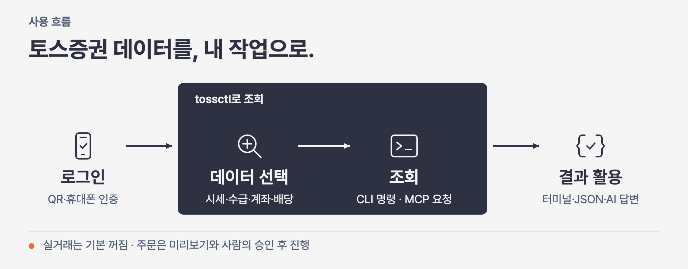

<p align="center">
  <a href="https://tossinvest-cli.vercel.app/"></a>
</p>

<p align="right"><strong>한국어</strong> · <a href="README.en.md">English</a></p>

<h1 align="center">tossinvest-cli</h1>

<p align="center">
  <strong>공식 API에서 빠진 투자 정보까지, 내 AI에게.</strong>
  <br />종목 탐색부터 자산·손익·세금·관심종목 관리까지, <code>tossctl</code> 하나로.
</p>

<p align="center">
  <a href="https://github.com/JungHoonGhae/tossinvest-cli/actions/workflows/ci.yml"></a>
  <a href="https://github.com/JungHoonGhae/tossinvest-cli/releases"></a>
  <a href="LICENSE"></a>
</p>

<p align="center">
  <a href="#빠른-시작"><strong>빠른 시작</strong></a> ·
  <a href="#공식-api만으로는-빠지는-것들"><strong>더 쓸 수 있는 기능</strong></a> ·
  <a href="#ai와-함께-사용하기"><strong>AI 연결</strong></a> ·
  <a href="#주문-전-확인하세요"><strong>주문 전 확인</strong></a> ·
  <a href="https://tossinvest-cli.vercel.app/docs"><strong>문서</strong></a>
</p>

> [!WARNING]
> 이 프로젝트는 토스증권 공식 제품이 아닙니다. 공식 Open API 외 기능은 토스증권 웹 내부 API를 비공식적으로 사용하며, 이용약관 위반에 해당할 수 있고 예고 없이 변경될 수 있습니다. 계좌 제한·손실 등 사용 결과는 사용자 본인의 책임입니다.

## 공식 API만으로는 빠지는 것들

tossctl은 [공식 API에 없는 **30가지 이상의 기능**](https://tossinvest-cli.vercel.app/docs/reference/support-scope)을 내 AI와 자동화에 연결합니다. 종목을 찾는 일부터 내 자산의 변화와 세금 자료를 확인하는 일까지 한곳에서 다루세요.

| 더 할 수 있는 일 | 공식 Open API | tossctl에서 연결하는 기능 |
|---|:---:|---|
| 종목 발굴·분석 | 미지원 | 토스 AI 시그널·등락 이유·조건검색·업종별 분석 |
| 뉴스·투자 일정 확인 | 미지원 | 보유·관심종목 뉴스·어닝콜·주요 경제지표 일정 |
| 내 자산·성과 모아 보기 | 미지원 | 전체 계좌 합산·평가 이력·배당·기간별 실현손익 |
| 세금·추가 수익 확인 | 미지원 | 해외 양도소득·예탁금 이자·주식대여 예상 수익 |
| 내 투자 관리 | 미지원 | 관심종목 폴더·목표가 알림·숨긴 종목·주식모으기 조회 |

**“잔고가 얼마야?”에서 “내 자산 변화와 받은 배당, 보유 종목 뉴스까지 정리해 줘”로.** 앱에서 따로 확인하던 정보를 이제 내 AI에게 요청하세요.

<p align="center">
  
</p>

위 추가 기능은 WTS(토스증권 웹 내부 API)를 사용합니다. 지원 대상은 **토스증권**이며, 일반 토스뱅킹·카드 소비 내역은 포함하지 않습니다. [전체 기능 비교 →](https://tossinvest-cli.vercel.app/docs/reference/support-scope)

## 빠른 시작

macOS / Linux:

```bash
curl -fsSL https://raw.githubusercontent.com/JungHoonGhae/tossinvest-cli/main/install.sh | sh
tossctl auth login
tossctl account summary --output json
```

휴대폰 인증 후 **이 기기 로그인 유지**까지 승인하세요. QR 대신 링크를 쓰려면 `tossctl auth login --link`로 로그인합니다.

<details>
<summary>Windows · Homebrew · 공식 API 연결</summary>

Windows PowerShell에서 설치한 뒤 위의 로그인·조회 명령을 실행하세요.

```powershell
irm https://raw.githubusercontent.com/JungHoonGhae/tossinvest-cli/main/install.ps1 | iex
```

공식 Open API 키를 연결하려면:

```bash
tossctl openapi login
tossctl openapi status
```

Homebrew·소스 빌드는 [설치 문서](https://tossinvest-cli.vercel.app/docs/getting-started/installation), 인증·연결 문제는 `tossctl doctor --report`를 참고하세요.

</details>

<details>
<summary>설치부터 첫 조회까지 — 데모</summary>

<p align="center">
  
</p>

</details>

## 이렇게 사용하세요

```bash
# 시장 살펴보기
tossctl quote flows A005930
tossctl market signals

# 내 배당 확인하기
tossctl portfolio dividends

# 보유 종목을 스크립트로 넘기기
tossctl portfolio positions --output json
```

위 수급 명령은 WTS를 사용하며, 공식 API의 투자자별 매매동향 조회도 별도로 지원합니다. AI 시그널·배당 등 추가 기능의 사용법은 [명령 레퍼런스](https://tossinvest-cli.vercel.app/docs/reference/commands)에서 확인하세요.

<details>
<summary>실시간 구독 · API 감시 · 로컬 이력</summary>

```bash
# 전체 계좌 자산과 보유 종목 브리핑
tossctl account overview
tossctl portfolio briefing

# 실시간 체결 구독과 API 변경 감시
tossctl stream --trade A005930
tossctl monitor api           # 읽기 전용 점검; 통과 0, 실패 1
```

`tossctl history sync`로 보유 종목·거래 내역 수집을 미리 확인할 수 있습니다. 저장 후 `history list`, `history search`, `history compare`는 오프라인으로 동작합니다.

`--fields symbol,quantity --compact`로 필요한 JSON 필드만 받으세요. [로컬 이력·브리핑 가이드 →](https://tossinvest-cli.vercel.app/docs/guide/history)

</details>

## AI와 함께 사용하기

<p align="center">
  
</p>

**설치한 tossctl을 AI 앱에 연결하면 말로 요청할 수 있습니다.** Claude Code·Codex·Cursor에서 MCP 연결을 지원합니다.

Claude Code에 MCP를 등록하려면:

```bash
claude mcp add tossctl tossctl mcp
```

연결한 에이전트에 이렇게 요청하세요.

> 내 자산 변화와 받은 배당을 정리하고, 보유 종목 뉴스도 함께 보여줘.

Codex·Cursor 등 앱별 등록 방법은 [MCP 가이드](https://tossinvest-cli.vercel.app/docs/guide/mcp)를 참고하세요.

<details>
<summary>다른 AI 앱에 연결하기 — MCP 설정</summary>

사용하는 AI 앱이 아래 형식의 MCP 설정을 지원하면 추가하세요.

```json
{
  "mcpServers": {
    "tossinvest": { "command": "tossctl", "args": ["mcp"] }
  }
}
```

</details>

<details>
<summary>AI 에이전트에 MCP 연결 — 데모</summary>

<p align="center">
  
</p>

</details>

## 주문 전 확인하세요

> [!IMPORTANT]
> **실거래는 기본적으로 꺼져 있습니다.** 에이전트는 주문을 미리보기합니다. 실제 주문은 사람이 검토·승인하고 실행하세요.

```bash
tossctl order preview --symbol AAPL --side buy --qty 1 --price 200
# 미리보기만 실행합니다. 실제 주문은 사람이 결과와 확인 토큰을 검토한 뒤 진행하세요.
```

- **주문 내용 확인:** 종목·수량·가격을 미리보기에서 확인한 뒤 직접 승인하고 실행하세요.
- **관심종목·알림 변경:** 무엇이 바뀌는지 미리 확인하고 승인하세요.
- **전송 결과를 모를 때:** 다시 주문하기 전에 주문 상태부터 확인하세요.

<details>
<summary>미국 옵션 모의투자 — 실험 기능</summary>

아직 안정화 중이며 기본적으로 숨겨져 있습니다. 활성화해도 토스증권의 이용 자격을 별도로 충족해야 합니다. 모의투자와 실거래의 잔고·주문은 분리되고, 모의 주문 승인이 실거래 승인으로 이어지지 않습니다. 설정과 제한은 [지원 범위](https://tossinvest-cli.vercel.app/docs/reference/support-scope)에서 확인하세요.

</details>

거래를 활성화하는 방법과 확인 절차는 [안전 가이드](https://tossinvest-cli.vercel.app/docs/guide/safety)를 참고하세요.

## 문서

| 문서 | 내용 |
|---|---|
| [빠른 시작](https://tossinvest-cli.vercel.app/docs/getting-started/quickstart) | 설치 후 첫 조회까지 |
| [명령 레퍼런스](https://tossinvest-cli.vercel.app/docs/reference/commands) | 전체 CLI 명령과 예시 |
| [지원 범위](https://tossinvest-cli.vercel.app/docs/reference/support-scope) | 공식 API·WTS 기능 비교 |
| [AI 앱 연결](https://tossinvest-cli.vercel.app/docs/guide/mcp) | Claude Code·Codex·Cursor 설정 |
| [안전 가이드](https://tossinvest-cli.vercel.app/docs/guide/safety) | 실제 주문 전 설정과 확인 절차 |

문제나 제안은 [Issues](https://github.com/JungHoonGhae/tossinvest-cli/issues)에 남겨주세요. 보안 문제는 [`SECURITY.md`](SECURITY.md)를 참고하세요.

## 후원

<p align="center">
  <a href="https://github.com/sponsors/JungHoonGhae"></a>
</p>

<!-- sponsors:start -->

<p align="center">
  <a href="https://github.com/sponsors/JungHoonGhae" title="비공개 후원자 / private sponsor"></a>
</p>

<p align="center"><sub>현재 <strong>1</strong>분이 제 오픈소스 작업을 후원하고 있습니다 (일회성 포함). 후원은 tossinvest-cli를 포함한 제 작업 전반에 쓰입니다.</sub></p>

<!-- sponsors:end -->

## Contributors

기여해 주신 모든 분께 감사합니다. 참여 방법은 [`CONTRIBUTING.md`](CONTRIBUTING.md)를 참고하세요.

[](https://github.com/JungHoonGhae/tossinvest-cli/graphs/contributors)

## Star History

<!-- star-history:start -->
<picture>
  <source media="(prefers-color-scheme: dark)" srcset="docs/assets/star-history/star-history-v2-dark.svg">
  
</picture>
<!-- star-history:end -->

## License

[MIT](LICENSE)
