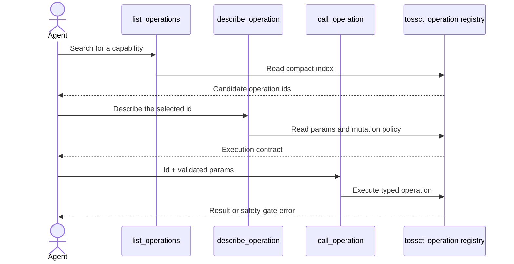

`tossctl mcp` runs tossctl as an **MCP (Model Context Protocol) server**. Register it with an MCP
host (Claude Code, Claude Desktop, Codex, …) and an agent can drive accounts, balances, quotes,
order books, trades, candles (official) plus **popularity rankings, investor flows, AI signals,
screeners, sectors, earnings, briefings, dividends and other WTS-only reads** in natural language —
and also place orders (buy/sell, cancel, amend). It speaks JSON-RPC 2.0 over stdin/stdout; no
separate server or port.

## Quick start — 3 steps

MCP is a mode of the `tossctl` binary. **Install the CLI first** and register it with your host. Catalog discovery and local history work without credentials; remote operations require their official key or WTS session.

```bash
# 1) Install tossctl
curl -fsSL https://raw.githubusercontent.com/JungHoonGhae/tossinvest-cli/main/install.sh | sh

# 2) Connect auth for remote operations (optional for local history)
tossctl openapi login    # Official Open API: official reads + orders
tossctl auth login       # WTS web session: WTS-only reads (rankings, flows, AI signals, …)

# 3) Register with the host + verify (Claude Code example)
claude mcp add tossctl tossctl mcp
claude mcp list   # → "tossctl: tossctl mcp - ✔ Connected"
```

For Codex, register with the following command; see the [official OpenAI MCP documentation](https://developers.openai.com/codex/mcp/).

```bash
codex mcp add tossctl -- tossctl mcp
```

For hosts supporting `mcpServers` JSON (such as Claude Desktop), see [JSON config](#mcp-host-json-config).

## Why a catalog — load schemas when needed

tossctl's default API surface is **117 operations**. Instead of listing every schema up front, agents discover the operation and schema they need. Tool-loading behavior varies by host, so no fixed token savings are guaranteed.

Following [KIS_MCP_Server](https://github.com/pineconedata/kis-mcp-server)'s catalog mode, tossctl
exposes **just 3 fixed tools** up front and keeps every operation behind them, fetching a schema
**only when needed**.

| Tool | Role |
|---|---|
| `list_operations` | Fetch a compact discovery index (id, domain, environment, experimental gate, summary, `backend`, write flag, required parameter names); filter with `query` |
| `describe_operation` | Fetch one operation's method/path, full parameters, and mutation risk/approval/recovery policy **on demand** |
| `call_operation` | Invoke by id + params |

MCP exposes **three tools**: `list_operations` → `describe_operation` → `call_operation`. Search results and call responses still consume context; total token usage is not constant.



<Callout type="info" title="Restart the host after updating the binary">
The host stores the **command** `tossctl mcp` and re-runs it each session, so upgrading just the
binary (`brew upgrade tossctl` or `tossctl update`) surfaces new operations **without
re-registering** on the next session/host restart (the catalog is built from the binary at server
start). `list_operations` is always the source of truth for what's currently exposed.
</Callout>

## Scope — reads/settings from official + WTS, live orders official-only

MCP exposes **reads and verified settings changes across the official Open API and WTS**, and routes
**live orders through the official API path only**. `list_operations` tags each operation with `backend`
and a write flag; inspect every write's full `mutation` policy through `describe_operation`.

- **Reads** — the official API (accounts, quotes, order book, trades, candles, …) plus **WTS-only**
  (rankings, flows, AI signals, screeners, sectors, earnings, briefings, dividends, realized P&L,
  transactions, watchlist, … — see
  [what the official API can't, tossctl can](/en/docs/guide/hybrid-openapi)).
  WTS reads need a web session; without one, that operation returns a `tossctl auth login` hint.
  Securities trading settings, transfer accounts, and accumulation funding status are
  `trading_settings`, `securities_transfer_accounts`, and `accumulation_funding_status` respectively. The last operation also accepts the legacy `banking_status` alias. The
  first two accept an optional `account` key for non-primary Securities accounts.
- **Live writes** — create/cancel/amend always use the **official API path only** (never WTS). The live-order catalog is wired to an official broker, unlike the WTS route available to regular CLI orders.
- **WTS settings writes** — Open API allowed IPs, target-price alerts, hidden holdings, and watchlist
  folders/items are changeable. Each previews by default, requires `execute:true` plus a valid
  `confirm` token, and re-reads server state. Watchlist tokens are bound to the current WTS session
  and expire after five minutes. Irreversible folder deletion also requires
  `acknowledge_irreversible:true`.
- **Experimental paper orders** — eight operations join discovery only when
  `experimental.paper_trading=true`. They declare `environment=paper` and
  `experimental=paper-trading`, use only WTS's isolated simulation ledger, and require
  `simulation_execute` (`execute:true`, no live confirmation). Observations from 2026-09-03 include initialization 500s and inconsistent education state. Track current observations and promotion criteria in `rolling_features` in the [WTS inventory](https://github.com/JungHoonGhae/tossinvest-cli/blob/main/docs/reverse-engineering/wts-endpoints.json).
- **Separate auth** — official reads/orders use the official key (`openapi login`), WTS reads use the
  web session (`auth login`). The server starts **without credentials**, and each remote operation checks the
  auth it needs. Use the `auth_status` operation to see which backends are connected and when they
  expire.

## Order safety gate

Order execution is **gated exactly like the CLI** (`tossctl order`). See [Safety](/en/docs/guide/safety).

- Enabled by `trading.*` + `allow_live_order_actions` toggles in config (all off by default)
- A plain call returns a **dry-run preview** (`confirm_token` + warnings)
- Real submission requires `execute: true` + `confirm: <token>`
- Orders use the **official API path only** (never WTS)

<Callout type="warn" title="Reads-only recommended for autonomous agents">
With `trading.*` off (the default), order operations are blocked at the gate even if called. Opening
trading requires a human to flip config explicitly, and each real submission still needs
`execute:true` + a valid `confirm` token. Non-trading writes follow their operation's `mutation`
policy: preview, confirmation, post-read verification, and rollback or a separate irreversible
acknowledgement where applicable.
</Callout>

## MCP host JSON config

Claude Code is one line — `claude mcp add` above. Hosts supporting `mcpServers` JSON (such as Claude Desktop) take
this in their config file (`tossctl` must be on `PATH`):

```json
{
  "mcpServers": {
    "tossinvest": { "command": "tossctl", "args": ["mcp"] }
  }
}
```

## CLI vs MCP — when to use which (complementary)

Two entrances to the same `tossctl` binary; **both work well with AI agents.** Not a competition —
just different ways to connect.

| | **CLI** (`tossctl ...`) | **MCP** (`tossctl mcp`) |
|---|---|---|
| How it runs | Shell command | Structured MCP tools (JSON-RPC, no shell) |
| Where | Anywhere there's a shell — terminal, scripts, cron, and shell-using agents | MCP-native hosts — operations as tools (3-tool catalog minimizes context) |
| How the agent knows | Must be told via prompt / skill / `AGENTS.md`/`CLAUDE.md` | **Auto-surfaced in the tool list on registration** |
| Auth | Web session for WTS features; official key for official-only commands (connect both for the full surface) | Official key for official reads/orders, web session for WTS reads; local history needs neither |
| Coverage | With both credentials: official + WTS reads, orders, live streaming, and watchlist writes | Reads/settings official+WTS, orders official-only. Target-price, hidden-holding, watchlist, and allowed-IP writes included; no live streaming |

- **Scripts, cron, pipes, reproducible automation** fit the CLI (explicit inputs and structured output).
- **MCP-native agents** call it as a tool with no extra instruction once registered.
- Live-order confirmation gates are shared, but CLI/MCP coverage, credentials, and submission routes differ as shown above.

---

For the full command/operation list see the [Command reference](/en/docs/reference/commands); for
official vs WTS routing see the [Auto-routing guide](/en/docs/guide/hybrid-openapi).

## Local history and output fields

`history_list`, `history_positions`, `history_transactions`, and `history_compare` are offline reads. `history_sync` saves WTS observations in a local DB through preview/confirm; `portfolio_briefing` combines holdings-related reads. `call_operation` accepts a `fields` array alongside `params` to project the result JSON. See [usage examples](/en/docs/guide/history).
