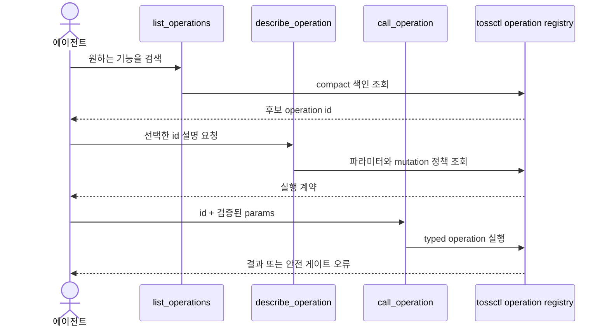

`tossctl mcp` 는 tossctl 을 **MCP(Model Context Protocol) 서버**로 띄웁니다. Claude Code·Claude
Desktop·Codex 등 MCP 호스트에 등록하면, 에이전트가 자연어로 계좌·잔고·시세·호가·체결·캔들(공식)과
**인기 순위·수급·AI 시그널·스크리너·업종·어닝·브리핑·배당 등 WTS 전용 조회**까지 다루고,
**주문(매수/매도·취소·정정)** 도 실행할 수 있습니다. stdin/stdout(JSON-RPC 2.0)으로 동작하며 별도
서버·포트가 필요 없습니다.

## 빠른 시작 — 3단계

MCP는 `tossctl` 바이너리의 한 모드입니다. **CLI를 먼저 설치**하고 호스트에 등록하세요. 카탈로그 탐색과 로컬 이력은 인증 없이 사용할 수 있으며, 원격 조회·주문에는 해당 공식 키 또는 웹 세션이 필요합니다.

```bash
# 1) tossctl 설치
curl -fsSL https://raw.githubusercontent.com/JungHoonGhae/tossinvest-cli/main/install.sh | sh

# 2) 원격 기능에 필요한 인증 연결 (로컬 이력은 생략 가능)
tossctl openapi login    # 공식 Open API: 공식 조회 + 주문
tossctl auth login       # WTS 웹 세션: WTS 전용 조회(인기순위·수급·AI시그널 등)

# 3) MCP 호스트에 등록 + 연결 확인 (Claude Code 예시)
claude mcp add tossctl tossctl mcp
claude mcp list   # → "tossctl: tossctl mcp - ✔ Connected"
```

Codex는 다음 명령으로 등록합니다. [OpenAI 공식 MCP 문서](https://developers.openai.com/codex/mcp/)도 참고하세요.

```bash
codex mcp add tossctl -- tossctl mcp
```

Claude Desktop 등 `mcpServers` 형식을 지원하는 호스트는 아래 [JSON 설정](#mcp-호스트-json-설정)을 쓰세요.

## 왜 catalog 방식인가 — 필요한 스키마만 조회

tossctl의 기본 API 표면은 **117개 오퍼레이션**입니다. 모든 설명을 처음부터 나열하는 대신 필요한 기능과 스키마를 조회합니다. 호스트마다 도구 로딩 방식이 다르므로 고정된 토큰 절감량을 보장하지는 않습니다.

tossctl 은 [KIS_MCP_Server](https://github.com/pineconedata/kis-mcp-server) 의 catalog 모드를
참조해, 앞단에 **고정 3개 툴만** 노출하고 나머지 오퍼레이션 전부는 **필요할 때만 스키마를 꺼내오는**
구조로 뒤에 둡니다.

| 툴 | 역할 |
|---|---|
| `list_operations` | compact 탐색 색인(id·도메인·environment·experimental·요약·`backend`·write 여부·필수 파라미터) 조회, `query` 로 필터 |
| `describe_operation` | 특정 오퍼레이션의 method/path·전체 파라미터·쓰기 위험/승인/복구 정책을 **그 순간에만** 조회 |
| `call_operation` | id + 파라미터로 실제 호출 |

MCP에 등록되는 도구는 **3개**입니다. `list_operations` → `describe_operation` → `call_operation` 순서로 탐색·확인·호출합니다. 검색 결과와 호출 응답도 컨텍스트를 사용하므로 총 사용량이 고정되는 것은 아닙니다.



<Callout type="info" title="바이너리 업데이트 후 호스트를 재시작하세요">
호스트는 `tossctl mcp` 라는 **명령어**를 저장해 세션마다 새로 실행하므로, `brew upgrade
tossctl`(또는 `tossctl update`)로 바이너리만 갱신하면 다음 세션·호스트 재시작 때 새
오퍼레이션이 **재등록 없이** 반영됩니다(catalog 는 서버 시작 시 바이너리에서 구성). 현재 노출되는
오퍼레이션 전체 목록은 항상 `list_operations` 가 정답입니다.
</Callout>

## 노출 범위 — 조회·설정은 공식+WTS, 실주문은 공식 전용

MCP 는 **조회와 검증된 설정 변경을 공식 Open API + WTS에 걸쳐** 노출하고, **실주문(write)은 공식 API 경로만**
씁니다. `list_operations`는 `backend`와 write 여부를 표시하며, 쓰기의 전체 `mutation` 정책은 `describe_operation`에서 확인합니다.

- **조회(read)** — 공식 API(계좌·시세·호가·체결·캔들 등)와 **WTS 전용**(인기 순위·수급·AI 시그널·
  스크리너·업종·어닝·브리핑·배당·실현손익·거래내역·관심종목 등, [공식으로 막히는 것 →
  tossctl 로 되는 것](/docs/guide/hybrid-openapi) 참고)을 함께 노출합니다. WTS 조회는 웹 세션이 필요하고, 없으면 해당 오퍼레이션이 `tossctl auth
  login` 안내를 돌려줍니다. 증권 거래 설정·주식이체 계좌·주식모으기 자금연결 상태는
  `trading_settings`·`securities_transfer_accounts`·`accumulation_funding_status`로 호출합니다. 마지막 오퍼레이션은 이전 `banking_status`도 alias로 허용하며, 앞의 두
  오퍼레이션은 선택적 `account`로 기본 계좌 외 계좌도 지정합니다.
- **실주문(write)** — 생성·취소·정정은 **항상 공식 API 경로만** 사용합니다(WTS 미경유).
  실주문 카탈로그가 공식 broker에 연결되어 있기 때문입니다. CLI 일반 주문의 WTS 경로와 구분합니다.
- **WTS 설정 쓰기** — Open API 허용 IP, 목표가 알림, 숨긴 보유종목, 관심종목 폴더·종목을 변경합니다.
  모두 기본 preview, `execute:true` + 유효한 `confirm`, 변경 후 서버 재조회를 거칩니다. 관심종목
  토큰은 현재 WTS 세션에 묶이고 5분 뒤 만료됩니다. 폴더 삭제는 되돌릴 수 없어
  `acknowledge_irreversible:true`도 필요합니다.
- **실험적 모의주문** — `experimental.paper_trading=true`일 때만 8개 오퍼레이션이 추가됩니다.
  `environment=paper`, `experimental=paper-trading`으로 표시되며 WTS의 격리된 모의 원장만
  사용합니다. 모의 쓰기는 `simulation_execute`라 `execute:true`만 요구하고 실계좌 confirm이나
  권한으로 승격되지 않습니다. 2026-09-03 관측에서는 초기화 500과 교육 상태 불일치가 남았습니다. 현재 상태·승격 기준은 [WTS 관측 기록](https://github.com/JungHoonGhae/tossinvest-cli/blob/main/docs/reverse-engineering/wts-endpoints.json)의 `rolling_features`에서 추적합니다.
- **인증 분리** — 공식 조회·주문은 공식 키(`openapi login`), WTS 조회는 웹 세션(`auth login`).
  **MCP 서버는 인증 없이도 시작되며**, 각 원격 오퍼레이션이 자기에게 필요한 인증을 확인합니다.
  `auth_status` 오퍼레이션으로 어떤 백엔드가 연결됐는지·언제 만료되는지 진단할 수 있습니다.

## 주문 안전 게이트

주문 실행은 CLI(`tossctl order`)와 **동일하게 게이트**됩니다. [안전 모델](/docs/guide/safety) 참고.

- config 의 `trading.*` + `allow_live_order_actions` 토글로 켜야 함 (기본 전부 꺼짐)
- 기본 호출은 **dry-run preview**(`confirm_token`·경고 반환)
- 실제 제출은 `execute: true` + `confirm: <token>` 을 함께 넘겨야 함
- 주문은 **공식 API 경로만 사용**(WTS 미경유)

<Callout type="warn" title="자율 에이전트엔 조회 전용 권장">
config 에서 `trading.*` 를 끈 상태(기본값)면 주문 오퍼레이션은 게이트에서 막힙니다. 거래까지
열려면 사람이 명시적으로 config 를 켜야 하며, 실제 제출은 매번 `execute:true` + 유효한 `confirm`
토큰이 필요합니다. 비거래 쓰기도 각 operation의 `mutation` 정책에 따라 preview·confirm·서버
재조회와 필요한 경우 복구 또는 별도 비가역 승인을 거칩니다.
</Callout>

## MCP 호스트 JSON 설정

Claude Code 는 위 [빠른 시작](#빠른-시작--3단계)의 `claude mcp add` 한 줄로 끝납니다. Claude
Desktop 등 `mcpServers` JSON 형식을 지원하는 호스트는 다음을 설정 파일에 넣으세요(`tossctl` 이 PATH 에 있어야
합니다).

```json
{
  "mcpServers": {
    "tossinvest": { "command": "tossctl", "args": ["mcp"] }
  }
}
```

## CLI 와 MCP — 언제 무엇을 (상호 보완)

같은 `tossctl` 바이너리의 두 입구이고, **둘 다 AI 에이전트와 잘 맞습니다.** 경쟁이 아니라 연결
방식이 다를 뿐입니다.

| | **CLI** (`tossctl ...`) | **MCP** (`tossctl mcp`) |
|---|---|---|
| 실행 방식 | 셸 명령 | 구조화된 MCP 툴 (JSON-RPC, 셸 불필요) |
| 어디서 | 셸이 있는 어디서든 — 터미널·스크립트·cron, 그리고 셸을 쓰는 AI 에이전트 | MCP 네이티브 호스트 — 오퍼레이션을 툴로 호출 (catalog 3툴로 컨텍스트 최소화) |
| 에이전트가 아는 법 | 프롬프트·스킬·`AGENTS.md`/`CLAUDE.md` 로 알려줘야 함 | **등록 시 툴 목록에 자동 노출** |
| 인증 | WTS 기능은 웹 세션, official-only 기능은 공식 키(둘 다 연결하면 전체 범위) | 공식 조회·주문엔 공식 키, WTS 조회엔 웹 세션; 로컬 이력은 인증 불필요 |
| 커버 범위 | 두 인증을 연결하면 공식 + WTS 조회·주문·실시간 스트리밍·관심종목 쓰기 | 조회·설정은 공식+WTS, 주문은 official-only. 목표가·숨김·관심종목·허용 IP 쓰기 포함; 실시간 스트리밍은 미포함 |

- **스크립트·cron·파이프·재현 가능한 자동화**는 CLI 가 자연스럽습니다(명시적인 입력과 구조화된 출력).
- **MCP 네이티브 에이전트**는 등록만 하면 별도 안내 없이 툴로 호출합니다.
- 실주문의 확인 게이트는 공통이지만, CLI와 MCP의 기능·인증·주문 제출 경로는 위 표처럼 다릅니다.

---

전체 명령·오퍼레이션은 [명령 레퍼런스](/docs/reference/commands), 공식 vs WTS 경로 차이는
[자동 라우팅 가이드](/docs/guide/hybrid-openapi)를 참고하세요.

## 로컬 이력과 출력 필드

`history_list`, `history_positions`, `history_transactions`, `history_compare`는 오프라인 조회입니다. `history_sync`는 WTS 데이터를 로컬 DB에 저장하는 preview/confirm 작업이며, `portfolio_briefing`은 보유 종목 관련 조회를 합칩니다. `call_operation`은 `params`와 별도로 `fields` 배열을 받아 반환 JSON을 선택합니다. [사용 예시](/docs/guide/history)를 참고하세요.
