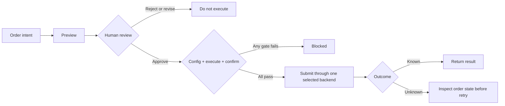

tossctl applies **separate execution policies to live trading, settings, and paper trading**. They reduce unintended submissions, but cannot guarantee against wrongly approved orders or losses.

## Disabled by default

All trading actions are off after install. Orders, cancels, and amends fail unless you
explicitly allow them in `config.json`.

```json
{
  "trading": {
    "place": true,
    "sell": true,
    "allow_live_order_actions": true
  }
}
```

- Without `place`, no order can be placed.
- Selling requires the additional `sell` grant (the user scopes "buy-only / include sell").
- `allow_live_order_actions` is the master kill switch for every live-account order.

## Two-step execution gate



A live trade requires both:

```bash
tossctl order place --symbol TSLA --side buy --qty 1 --price 250 \
  --execute --confirm 'PREVIEW_CONFIRM_TOKEN'
```

- Order commands do not submit without `--execute`.
- Replace `PREVIEW_CONFIRM_TOKEN` with the fresh preview token: `order preview` for place, or the cancel/amend command's own preview.

## Always preview first

`order preview` validates order intent, quantity, price, and estimated value without sending an order. Estimates do not guarantee fills or final fees.

```bash
tossctl order preview --symbol TSLA --side buy --qty 1 --price 250
```

Agents must follow **preview → user confirmation → place**.

## Submission routes and uncertain outcomes

Regular CLI orders select one official or WTS backend. MCP/`ops` live orders and all conditional orders are official-only. A failure never triggers a cross-backend resubmission. WTS history reconciliation is best-effort; inspect `unknown` or `pending` outcomes before retrying the same order.

## Settings and paper trading

Watchlists, price alerts, hidden holdings, and allowed-IP changes preview by default. Execution requires approval for the current request and a state-bound confirmation token. Irreversible actions require an additional acknowledgement.

US-options paper trading is exposed only with `experimental.paper_trading=true`. Simulation writes use a separate `simulation_execute` policy and `--execute`, not live config or tokens. `paper order live-preview` creates a live preview but never submits an order. Do not treat server-rejected initialization, education, or orders as approved.

## Market symmetry

KR and US trading use the same gate. (A KR order is no riskier than a US one, so the old
asymmetric option was removed.)

## Privacy

- State files and QR images use owner-only `0600`; state directories use `0700` on supported operating systems.
- `doctor --report` JSON masks home paths automatically.
- Default `monitor` summaries omit raw account responses. Review custom webhooks, logs, and data sent to AI hosts separately.

## Agent notes

Follow the rules in the [AI Agent Guide](/en/docs/guide/agents) — especially no gate bypass, no real
data exposure, and preview-before-place.
