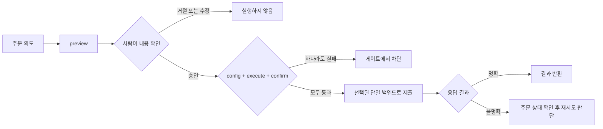

tossctl은 **실거래·설정 변경·모의투자에 서로 다른 실행 승인**을 적용합니다. 이 보호 장치는 의도하지 않은 제출을 줄이지만 잘못 승인한 주문이나 손실을 보장해서 막지는 않습니다.

## 기본 비활성

설치 직후 모든 거래 기능은 꺼져 있습니다. `config.json` 에서 명시적으로 허용하지 않으면
주문·취소·정정이 실패합니다.

```json
{
  "trading": {
    "place": true,
    "sell": true,
    "allow_live_order_actions": true
  }
}
```

- `place` 없이는 주문 자체가 불가
- 매도는 `sell` 추가 허용 필요 (유저가 "매수만 / 매도 포함"을 스스로 범위 제한)
- `allow_live_order_actions`는 모든 실계좌 주문의 마스터 킬스위치

## 실행 2단계 게이트



실거래는 두 가지를 모두 줘야 나갑니다.

```bash
tossctl order place --symbol TSLA --side buy --qty 1 --price 250 \
  --execute --confirm 'PREVIEW_CONFIRM_TOKEN'
```

- 주문 명령에서 `--execute`가 없으면 실제 제출하지 않음
- `PREVIEW_CONFIRM_TOKEN`은 방금 실행한 미리보기의 토큰으로 교체. place는 `order preview`, cancel·amend는 해당 명령의 미리보기에서 받음

## 항상 미리보기 먼저

`order preview`는 주문을 보내지 않고 주문 의도·수량·가격과 예상 금액을 확인합니다. 예상값은 실제 체결이나 수수료를 보장하지 않습니다.

```bash
tossctl order preview --symbol TSLA --side buy --qty 1 --price 250
```

에이전트는 **반드시 preview → 사용자 확인 → place** 순서를 지켜야 합니다.

## 제출 경로와 불명확한 결과

CLI 일반 주문은 공식 API 또는 WTS 중 한 경로를 선택합니다. MCP·`ops` 실주문과 모든 조건주문은 공식 API 전용입니다. 실패해도 다른 경로로 재주문하지 않습니다. WTS 주문 이력 확인도 최선의 추정이므로 `unknown`·`pending`이면 직접 상태를 확인하기 전 같은 주문을 재시도하지 마세요.

## 설정 변경과 모의투자

관심종목·목표가 알림·숨김 종목·허용 IP 변경은 기본 preview이며, 현재 요청에 대한 사용자 승인과 상태에 묶인 confirm 토큰이 필요합니다. 불가역 작업은 추가 acknowledgement를 요구합니다.

미국 옵션 모의투자는 `experimental.paper_trading=true`인 경우에만 노출됩니다. 모의 원장 쓰기는 별도 `simulation_execute` 정책과 `--execute`를 사용하며, 실거래 config·토큰과 분리됩니다. `paper order live-preview`는 실주문 미리보기만 만들고 주문을 제출하지 않습니다. 서버가 거절한 초기화·교육·주문을 승인된 것으로 취급하지 않습니다.

## 시장 대칭

국내(KR)와 미국(US) 거래는 동일한 게이트를 적용합니다. (KR 주문이 US 주문보다 더
위험하지 않으므로, 과거의 비대칭 옵션은 제거됐습니다.)

## 개인정보 보호

- 상태 파일·QR 이미지는 `0600`, 상태 디렉터리는 `0700`의 소유자 전용 권한으로 관리합니다(지원 OS 기준).
- `doctor --report` 의 JSON 진단은 홈 경로를 자동 마스킹합니다.
- 기본 `monitor` 요약은 원본 계좌 응답을 포함하지 않습니다. 사용자 정의 webhook·로그와 AI 호스트에 전달하는 결과는 별도로 검토하세요.

## 에이전트 주의사항

[AI 에이전트 가이드](/docs/guide/agents)에 정리된 규칙을 따르세요 — 특히 거래 게이트 우회 금지,
실데이터 비노출, preview 선행.
